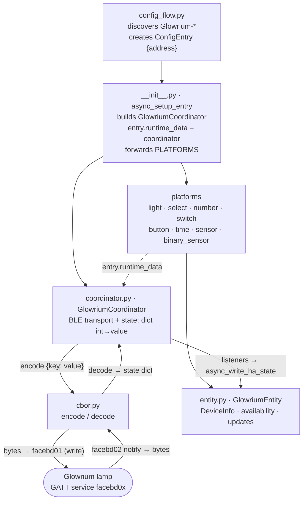

# Architecture

This document explains how the **Glowrium** Home Assistant integration is put
together and how it talks to the lamp over Bluetooth Low Energy. It is written
for contributors who want to understand the internals or add support for another
model in the Glowrium grow-light family (G2–G10).

For installation and day-to-day usage, see the [README](README.md). For the
step-by-step contribution workflow, see [CONTRIBUTING.md](CONTRIBUTING.md).

The BLE protocol was reverse-engineered from the official `com.inledco.glowrium`
Android app (btsnoop captures) and verified against real hardware. Everything is
**local** — no cloud, no vendor account, no BLE bond/pairing.

---

## High-level overview

The integration is a thin, active BLE client. A single **coordinator** owns the
connection to one lamp, mirrors the device's state, and exposes control methods;
Home Assistant entities are stateless views over that coordinator.

- **Transport:** a vendor GATT service (`facebd0x-…`, advertised as *"rabbit iot
  ble"*). Commands are **CBOR** maps written to one characteristic; state arrives
  as CBOR notifications on another.
- **State model:** the device is a bag of integer-keyed properties (`0x06` =
  power, `0x08` = brightness, …). The coordinator keeps the last-known value of
  each in `state: dict[int, Any]` and updates it from notifications.
- **Entities:** `light`, `select`, `number`, `switch`, `button`, `time`,
  `sensor`, `binary_sensor` — each reads from `coordinator.state` and calls a
  `coordinator.async_set_*` method to write.
- **No polling.** `iot_class` is `local_push`: the lamp pushes state via notify,
  and entities re-render from a coordinator listener callback.

### File map

| File (`custom_components/glowrium/…`) | Responsibility |
| --- | --- |
| `__init__.py` | `async_setup_entry` / `async_unload_entry`; builds the coordinator, stores it in `entry.runtime_data`, forwards platforms |
| `config_flow.py` | Bluetooth auto-discovery + manual picker for `Glowrium-*` devices |
| `coordinator.py` | BLE transport, reconnect, activation, state mirror, all command methods |
| `cbor.py` | Minimal CBOR encoder/decoder (only the subset the device uses) — the *wire* format |
| `protocol.py` | Semantic codec — byte layouts (`0x11` slot, `0x2f` ramp) ↔ values; the coordinator's typed accessors delegate here |
| `const.py` | GATT UUIDs, CBOR property keys, byte-layout offsets, mode constants |
| `models.py` | Per-model registry (name, icon, lighting-mode presets) keyed by `pkey` |
| `entity.py` | `GlowriumEntity` base — `DeviceInfo`, availability, update fan-out |
| `light.py` `select.py` `number.py` `switch.py` `button.py` `time.py` `sensor.py` `binary_sensor.py` | Platform entities |
| `strings.json`, `translations/`, `icons.json` | UI text and entity icons |
| `manifest.json` | Domain, Bluetooth matcher (`local_name: Glowrium-*`), requirements |

---

## Data flow



1. **`config_flow.py`** finds devices whose advertised name starts with
   `Glowrium` (auto-discovered via the manifest Bluetooth matcher, or picked from
   a list) and creates a config entry holding just the BLE `address`.
2. **`__init__.py` · `async_setup_entry`** constructs a `GlowriumCoordinator`,
   calls `async_start()` (which begins watching for and connecting to the lamp),
   stashes it in `entry.runtime_data`, and forwards the config entry to every
   platform.
3. **Each platform** reads `entry.runtime_data` (the coordinator) and registers
   its entities. Entities subclass `GlowriumEntity`.
4. **Reads:** entity properties pull from the coordinator — simple flags straight
   from `coordinator.state`, and decoded values (ramp minutes, schedule fields)
   via typed accessors backed by `protocol.py`. **Writes:** entity commands call
   `coordinator.async_set_*`, which CBOR-encodes a map and writes it to the lamp.
5. **Notifications** decoded from the lamp update `coordinator.state`; the
   coordinator then calls its listeners, and each entity re-renders via
   `async_write_ha_state()`.

---

## GATT transport

All control happens over one vendor service, `facebd00-7261-6262-6974-696f74626c65`
(the ASCII tail spells `rabbit iot ble`). UUIDs are defined in `const.py`.

| Characteristic | Const | Direction | Purpose |
| --- | --- | --- | --- |
| `facebd01-…` | `WRITE_UUID` | Write | **Commands.** Body is a CBOR map `{int key: value}`. One map may set several keys at once (e.g. power + brightness, or the whole bring-up clock). |
| `facebd02-…` | `NOTIFY_UUID` | Notify + Write | **State.** The lamp pushes CBOR maps of changed properties. On connect the integration *writes* the raw list of property ids it wants reported (see below). |
| `facebd80-…` | `INFO_UUID` | Read | **Device info** string, read once per connection and parsed into `DeviceInfo`. |

### Requesting state on connect

Right after subscribing to notifications, the coordinator writes the raw bytes of
`STATE_KEYS` (a tuple of property ids) to `NOTIFY_UUID`. This asks the lamp to
report those properties.

> ⚠️ **Only request ids the vendor app itself requests.** Asking the G7 for an id
> it does not expose makes it drop the GATT link. `STATE_KEYS` is exactly the set
> observed in the app's captures. A different model with a different property set
> may reject the request — the coordinator treats that as **non-fatal** (logs a
> warning and carries on with limited state) so the lamp is still controllable.

### Device-info string (`facebd80`)

A single readable, semicolon-delimited string:

```
brand:INLEDCO;pkey:Glowrium-C051;devid:CST-XXXXXXXX;mac:XX:XX:XX:XX:XX:XX;version:4;
```

Parsed by `_parse_device_info` into a `key:value` dict and surfaced as
`DeviceInfo`:

- `pkey` → **model id** (e.g. `Glowrium-C051`) — also the key used to resolve the
  per-model profile (see [Per-model registry](#per-model-registry)).
- `version` → **firmware version**.
- `devid` → **serial number**.

Two sibling characteristics exist but are unused: `facebd03` rejects reads
(write-only command/OTA channel) and `facebd81` returns a single constant byte.
The vendor app touches neither, and neither does this integration.

---

## CBOR wire format

`cbor.py` is a purpose-built, dependency-free CBOR codec covering only what the
device uses: maps keyed by unsigned ints, unsigned/negative ints, byte strings,
text strings, arrays, booleans, null, and IEEE-754 float32/float64. It is
validated byte-for-byte against captures in `tests/test_cbor.py`.

A command is just a CBOR map. For example, "turn on at 80 %" is
`{0x06: true, 0x08: 80}`, which encodes to a 5-byte payload written to
`facebd01`.

### Property-key table

Keys are defined in `const.py` and were verified against btsnoop captures and the
live device.

| Key | Const | Property | Type | Meaning |
| --- | --- | --- | --- | --- |
| `0x05` | `KEY_TIME` | Device clock | `bytes(7)` | `year_BE(2), month, day, hour, minute, second`. Set during bring-up / time sync. |
| `0x06` | `KEY_POWER` | Power | `bool` | Light on/off. |
| `0x08` | `KEY_BRIGHTNESS` | Brightness | `int 0..100` | Percentage. The `light` entity scales to HA's 0–255. |
| `0x09` | `KEY_CIRCADIAN` | Circadian mode | `bool` | Sunrise/sunset-synced auto mode. **Mutually exclusive** with `0x0d`. |
| `0x0a` | `KEY_LATITUDE` | Latitude | `float64` | Degrees. The lamp computes its own circadian curve from this. |
| `0x0b` | `KEY_LONGITUDE` | Longitude | `float64` | Degrees. |
| `0x0d` | `KEY_SCHEDULE` | Schedule mode | `bool` | Timer/schedule auto mode. **Mutually exclusive** with `0x09`. |
| `0x11` | `KEY_TIMER` | Schedule slot | `bytes(11)` | Pro schedule window. See [slot layout](#0x11-schedule-slot-layout). |
| `0x14` | `KEY_ACTIVATED` | Activated | `bool` | Light output enabled. `False` on a factory-reset device. See [Activation](#activation--bring-up). |
| `0x17` | `KEY_INDICATOR` | Indicator LED | `bool` | Front-panel status LED. |
| `0x2b` | `KEY_LIGHTING_MODE` | Lighting mode | `int` | Circadian preset index — **model-specific** (`models.py`). |
| `0x2f` | `KEY_RAMP` | Ramp time | `bytes(2)` | Big-endian seconds. `0` = Sun Sync auto ramp. |
| `0x35` | `KEY_DST` | DST | `bytes(5)` | `[enabled, offset_BE(4)]`; offset `0x00000e10` = 3600 s = 1 h. |

Helper keys used only during bring-up (see [Activation](#activation--bring-up)):

| Key | Const | Meaning |
| --- | --- | --- |
| `0x31` | `KEY_TIME_SYNCED` | Set to `1` alongside the clock (`0x05`). |
| `0x53` | `KEY_ACTIVATE_MISC` | Unconfirmed bring-up parameter; the app always sends `300`. |

Two more keys appear inside the lighting-mode command as constants:

- `0x2c` — constant `0x02d0`
- `0x32` — constant `0x001e`

Mutually-exclusive `0x09`/`0x0d` are collapsed into a single **Operating mode**
select in HA (`Manual` = both off, `Circadian`, `Schedule`) — see
`coordinator.operating_mode`.

### `0x11` schedule-slot layout

The schedule ("Pro" timer) is an 11-byte struct. A setter edits a field in place
and rewrites the whole slot, preserving the other bytes; the slot's byte offsets
live in `protocol.py` (`editable_timer_slot` plus the `schedule_*` decoders).

| Byte(s) | Field | Notes |
| --- | --- | --- |
| `0` | enabled | `1` = slot active |
| `1`–`3` | reserved | `00 00 00` |
| `4` | start hour | |
| `5` | start minute | |
| `6` | end hour | |
| `7` | end minute | |
| `8` | brightness | `0..100` |
| `9`–`10` | gradual | fade duration, seconds, **big-endian** |

Default (`TIMER_DEFAULT`): `01 00 00 00 06 00 12 00 64 00 00` → enabled, 06:00 →
18:00, 100 %, no fade.

### Lighting-mode command

Selecting a circadian preset (`0x2b`) also clobbers the ramp (`0x2f`) unless it is
resent. The command is a four-key map written **in this key order**
(`_mode_payload` in `coordinator.py`):

```
{ 0x2b: <mode index>, 0x2c: 0x02d0, 0x2f: <ramp>, 0x32: 0x001e }
```

The ramp is preserved from a remembered value (or state, or the `0x0e10` = 60 min
default). Because enabling Circadian resets the device's ramp to a default, the
coordinator re-applies the user's chosen ramp after a mode switch so it persists.

---

## Activation / bring-up

The lamp **gates its light output** on the `0x14` (`KEY_ACTIVATED`) flag. A
factory-reset ("virgin") device still advertises and accepts config commands, but
reports `0x14 = False` and its front-panel LEDs just blink — the light will not
turn on until it has been brought up.

The vendor app performs this bring-up on first pairing. It is **entirely local** —
the captures show **no SMP pairing / BLE bond and no cloud** — so the integration
replays the same sequence itself. On connect, `_async_activate_if_needed` waits
briefly for the initial state to arrive; if `0x14` reads `False`,
`async_activate` sends three commands to `facebd01`:

```
1.  { 0x53: 300 }                         # KEY_ACTIVATE_MISC
2.  { 0x05: <local time>, 0x31: 1 }       # set clock + time-synced flag
3.  { 0x14: True }                        # enable light output
```

Notes:

- These writes go through `_write_raw` while the connection lock is held (bring-up
  runs inside the connect path, `_connect_locked`), so it completes as one atomic
  step before any user command is serviced.
- It is **idempotent**: a device already activated (by the app, or a previous HA
  run) reports `0x14 = True` and the sequence is skipped. Activation survives HA
  restarts; `0x14` only clears on a factory reset.
- The **Activated** `binary_sensor` (diagnostic) surfaces this flag so users can
  see provisioning status.

---

## Availability model

**Entity availability follows the device's advertising presence, *not* the GATT
connection.** This is a deliberate design choice, and reviewers should not
"simplify" it back to the connection state.

The lamp **drops and re-establishes its GATT link on its own every ~30–60 min**.
If `available` were tied to the connection, every entity would flap to
`unavailable` for a few seconds on each reconnect, spraying noise into HA history.
Since the device advertises continuously, presence is a far better availability
signal.

```python
available = self._is_connected or self._present
```

- `_present` is maintained from the Bluetooth stack: seeded with
  `bluetooth.async_address_present`, set `True` by the advertisement callback, and
  set `False` by `bluetooth.async_track_unavailable` (device powered off / out of
  range).
- Reconnects happen **silently underneath** an entity that stays `available`.

### Reconnect

Two independent triggers, both funnelling into a single guarded reconnect task
(`_reconnecting` prevents a connect storm from the ~1 Hz advertisements):

1. **Advertisement callback** — when the lamp reappears and there is no live
   connection, kick off a reconnect.
2. **Periodic poll** — `async_track_time_interval` every `_RECONNECT_INTERVAL`
   (30 s) reconnects after any drop, independent of advertisement throttling.

Establishing a connection (`_async_ensure_connected`, serialized by an
`asyncio.Lock`) uses `bleak_retry_connector.establish_connection`, subscribes to
notifications, requests `STATE_KEYS`, reads device-info once, and runs activation
if needed.

**Commands are serialized on the same lock** and retried once: `_async_write`
holds the lock across connect-and-write, so a command cannot race the periodic
GATT churn; if the write still fails mid-command, the coordinator reconnects once
and retries before surfacing the error.

Mode-dependent entities (Lighting mode, Ramp, Schedule controls) gate their own
availability further via `coordinator.mode_allows(...)`, which returns `True` when
the operating mode matches **or is still unknown** — so they don't collapse to
`unavailable` before the first state read.

---

## Per-model registry

The CBOR protocol is shared across the Glowrium family; only a few things differ
per model: the marketing name, the light-entity icon, and the set of circadian
**lighting-mode presets** (label → command index). Those live in `models.py`,
keyed by the device-info `pkey`.

```python
@dataclass(frozen=True)
class GlowriumModel:
    pkey: str                       # device-info identifier, e.g. "Glowrium-C051"
    name: str                       # marketing name shown on the device page
    lighting_modes: dict[str, int]  # preset label -> command index (0x2b)
    icon: str | None = None         # light-entity icon
```

`resolve_model(pkey)` returns the matching profile, or a **generic fallback**
(name `Glowrium`, the reference presets) for an unknown/not-yet-read `pkey` — so
an unsupported device is still controllable rather than masquerading as a
specific, tested model. `coordinator.model` resolves this from the `pkey` read
off `facebd80`.

Only the **G7** (`Glowrium-C051`) is verified on hardware today.

### How to add a new model

1. **Capture the vendor app.** Pair the device with the official
   `com.inledco.glowrium` app once and record a Bluetooth HCI snoop log
   (Android's *btsnoop_hci.log*, or an external BLE sniffer) while you switch
   through **every** circadian lighting-mode preset in order.
2. **Find the lighting-mode indices.** Decode the `facebd01` writes as CBOR. Each
   preset switch is a `{0x2b: <index>, 0x2c: …, 0x2f: …, 0x32: …}` map — record
   the `0x2b` value for each preset label, in the app's order.
3. **Get the `pkey`.** Read the device-info string from `facebd80` (or check the
   device page in HA once it connects) — e.g. `Glowrium-Cxxx`.
4. **Add one entry to `models.py`.** Create a `GlowriumModel` with the `pkey`,
   marketing `name`, the `lighting_modes` map from step 2, and an optional `icon`;
   register it in the `MODELS` dict.
5. **Update docs/tests.** Flip the model's row in the README supported-devices
   table, and — if the indices are load-bearing — add coverage in
   `tests/test_coordinator.py`.

That's the whole change: **one `GlowriumModel` record**. Everything else
(transport, entities, activation, availability) is model-agnostic.

See [CONTRIBUTING.md](CONTRIBUTING.md) and the README's *"Tested an unverified
model?"* section for the full contributor workflow.

---

## Testing

Unit tests live in `tests/` and **never touch real Bluetooth**:

- `test_cbor.py` — the codec, checked against exact bytes from btsnoop captures.
- `test_coordinator.py` — command encoding (power, brightness, lighting mode,
  operating mode, indicator, DST, schedule) checked against real device bytes; the
  coordinator is driven with a patched/`None` BLE layer.
- `test_config_flow.py` — discovery and entry creation.

Run the checks:

```bash
.venv/bin/ruff check . && .venv/bin/ruff format --check .
.venv/bin/pytest
```

`pytest` runs in `asyncio_mode = "auto"`; ruff line length is 88 (config in
`pyproject.toml`). Manual verification against live hardware is separate — see the
README — but is not part of the automated suite.
