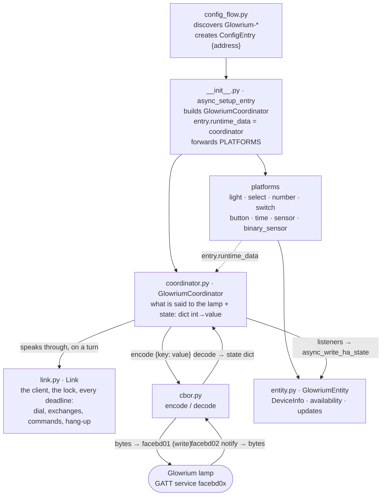

# Architecture

This document explains how the **Glowrium** Home Assistant integration is put
together and how it talks to the lamp over Bluetooth Low Energy. It is written
for contributors who want to understand the internals or add support for another
model in the Glowrium grow-light family (G2–G10).

For installation and day-to-day usage, see the [README](README.md). For the
step-by-step contribution workflow, see [CONTRIBUTING.md](CONTRIBUTING.md).

The BLE protocol was reverse-engineered from the official `com.inledco.glowrium`
Android app (btsnoop captures) and verified against real hardware. Everything is
**local** — no cloud, no vendor account, no BLE bond/pairing.

---

## High-level overview

The integration is a thin, active BLE client. A single **coordinator** owns the
connection to one lamp, mirrors the device's state, and exposes control methods;
Home Assistant entities are stateless views over that coordinator.

- **Transport:** a vendor GATT service (`facebd0x-…`, advertised as *"rabbit iot
  ble"*). Commands are **CBOR** maps written to one characteristic; state arrives
  as CBOR notifications on another.
- **State model:** the device is a bag of integer-keyed properties (`0x06` =
  power, `0x08` = brightness, …). The coordinator keeps the last-known value of
  each in `state: dict[int, Any]` and updates it from notifications.
- **Entities:** `light`, `select`, `number`, `switch`, `button`, `time`,
  `sensor`, `binary_sensor` — each reads from `coordinator.state` and calls a
  `coordinator.async_set_*` method to write.
- **No polling for state.** `iot_class` is `local_push`: the lamp pushes state
  via notify, and entities re-render from a coordinator listener callback. The
  coordinator's 30-second tick is for the link, not the state: it rebuilds one
  that was lost, and asks one that has been silent for five minutes whether it
  is still there (see [Reconnect](#reconnect)).

### File map

| File (`custom_components/glowrium/…`) | Responsibility |
| --- | --- |
| `__init__.py` | `async_setup_entry` / `async_unload_entry`; builds the coordinator, stores it in `entry.runtime_data`, forwards platforms, has the coordinator hang up when Home Assistant stops, and keeps for each lamp what could not be closed |
| `config_flow.py` | Bluetooth auto-discovery + manual picker for `Glowrium-*` devices |
| `coordinator.py` | The device: the state mirror, all command methods, the clock, activation, the telling of the entities - and what is said to the lamp: the first exchange on a link, the question for a silent one, each command. Home Assistant's watchers stand here and tell the link what they see |
| `link.py` | The link: the client and the lock around it, the dial, the hang-up and the closing of the client's bus, the stack that will not hang up, whether the lamp is in reach - and when the lamp is spoken to: the background connect, the first exchange, the question for a silent link, the delivery of a command with its one retry, and every deadline. No client leaves it. No Home Assistant in it and no protocol |
| `cbor.py` | Minimal CBOR encoder/decoder (only the subset the device uses) — the *wire* format |
| `protocol.py` | Semantic codec — byte layouts (`0x11` slot, `0x2f` ramp, `0x35` daylight saving, `0x05` clock) ↔ values, read and written; the coordinator's typed accessors and setters delegate here |
| `const.py` | GATT UUIDs, CBOR property keys, byte-layout offsets, mode constants |
| `models.py` | Per-model registry (name, lighting-mode presets) keyed by `pkey` |
| `diagnostics.py` | The diagnostics download: what the coordinator knows, rebuilt from what it read, with nothing in it the lamp chose |
| `entity.py` | `GlowriumEntity` base — `DeviceInfo`, availability, update fan-out |
| `light.py` `select.py` `number.py` `switch.py` `button.py` `time.py` `sensor.py` `binary_sensor.py` | Platform entities |
| `strings.json`, `translations/`, `icons.json` | UI text (entity and preset names, errors, the repair), and entity icons |
| `manifest.json` | Domain, Bluetooth matcher (`local_name: Glowrium-*`), requirements |

---

## Data flow


```mermaid
flowchart TD
    CF["config_flow.py<br/>discovers Glowrium-*<br/>creates ConfigEntry {address}"]
    INIT["__init__.py · async_setup_entry<br/>builds GlowriumCoordinator<br/>entry.runtime_data = coordinator<br/>forwards PLATFORMS"]
    COORD["coordinator.py · GlowriumCoordinator<br/>what is said to the lamp + state: dict int→value"]
    LINK["link.py · Link<br/>the client, the lock, every deadline:<br/>dial, exchanges, commands, hang-up"]
    CBOR["cbor.py<br/>encode / decode"]
    PLAT["platforms<br/>light · select · number · switch<br/>button · time · sensor · binary_sensor"]
    ENT["entity.py · GlowriumEntity<br/>DeviceInfo · availability · updates"]
    DEV(["Glowrium lamp<br/>GATT service facebd0x"])

    CF --> INIT
    INIT --> COORD
    COORD -->|"speaks through, on a turn"| LINK
    INIT --> PLAT
    PLAT -. "entry.runtime_data" .-> COORD
    PLAT --> ENT
    COORD -->|"encode {key: value}"| CBOR
    CBOR -->|"bytes → facebd01 (write)"| DEV
    DEV -->|"facebd02 notify → bytes"| CBOR
    CBOR -->|"decode → state dict"| COORD
    COORD -->|"listeners → async_write_ha_state"| ENT
```

1. **`config_flow.py`** finds devices whose advertised name starts with
   `Glowrium` (auto-discovered via the manifest Bluetooth matcher, or picked from
   a list) and creates a config entry holding just the BLE `address`.
2. **`__init__.py` · `async_setup_entry`** constructs a `GlowriumCoordinator`,
   calls `async_start()` (which begins watching for and connecting to the lamp),
   stashes it in `entry.runtime_data`, and forwards the config entry to every
   platform.
3. **Each platform** reads `entry.runtime_data` (the coordinator) and registers
   its entities. Entities subclass `GlowriumEntity`.
4. **Reads:** entity properties pull from the coordinator — simple flags straight
   from `coordinator.state`, and decoded values (ramp minutes, schedule fields)
   via typed accessors backed by `protocol.py`. **Writes:** entity commands call
   `coordinator.async_set_*`, which CBOR-encodes a map and writes it to the lamp.
5. **Notifications** decoded from the lamp update `coordinator.state`; the
   coordinator then calls its listeners, and each entity re-renders via
   `async_write_ha_state()`.

---

## GATT transport

All control happens over one vendor service, `facebd00-7261-6262-6974-696f74626c65`
(the ASCII tail spells `rabbit iot ble`). UUIDs are defined in `const.py`.

| Characteristic | Const | Direction | Purpose |
| --- | --- | --- | --- |
| `facebd01-…` | `WRITE_UUID` | Write | **Commands.** Body is a CBOR map `{int key: value}`. One map may set several keys at once (e.g. power + brightness, or the whole bring-up clock). |
| `facebd02-…` | `NOTIFY_UUID` | Read + Notify + Write | **State.** The lamp pushes CBOR maps of changed properties as they change, and *writing* a list of property ids to the same characteristic makes it report those — which is how state is primed on connect. It can be read as well; see below for why it is not. |
| `facebd80-…` | `INFO_UUID` | Read | **Device info** string, read once per session — after everything else on that link — and parsed into `DeviceInfo`. |
| `facebd03-…` | `UNUSED_CHANNEL_UUID` | Write + Notify | **Unused.** Shaped like a request/response or OTA channel; refuses a read with app-error `0x1e`. Nobody has written to it — doing so blind could change a setting with no way to read it back. The vendor app does not touch it. |
| `facebd81-…` | `UNUSED_VERSION_UUID` | Read | **Unused.** Returns a single byte `0x02` on both a G7 and a G8. Possibly a protocol version — but the G8 reports `version:2` in its device-info string and the G7 reports `version:4`, and both answer `0x02`, so it is not simply that. |

### Priming state on connect

Right after subscribing to notifications the coordinator **writes** the raw
bytes of `STATE_KEYS` (a tuple of property ids) to `NOTIFY_UUID`
(`_request_state` in `coordinator.py`). The lamp answers with a notification
carrying a map of exactly those ids — on a G7 one 72-byte frame, which arrives
before the write call has returned. That is the whole of priming on a lamp
that answers: nothing is read.

> ⚠️ **On BlueZ, a GATT read of this lamp ends the link.** `NOTIFY_UUID` is
> readable, and from 0.2.0 it was read first, on every connect — which looked
> sturdier than asking. Measured on a G7 (firmware 4) from a Linux host with
> BlueZ 5.82, outside the integration and between its poll ticks, on
> 2026-10-05:
>
> | After connecting | Runs | Link |
> | --- | --- | --- |
> | nothing | 1 | still up when the test ended it |
> | subscribe to notifications | 1 | still up |
> | subscribe, then write the state request | 7 | still up, state reported at once |
> | read `facebd02` (235 bytes) | 3 | gone 2.02–2.04 s later |
> | read `facebd80` (93 bytes) | 1 | gone 2.02 s later |
> | read `facebd81` (1 byte) | 2 | gone 2.02 s later |
>
> The read itself succeeds. BlueZ takes the ATT channel down right after it —
> the very next call answers `Not connected` — and two seconds later, which is
> BlueZ's own disconnect timer, reports the device disconnected. With a read
> on every connect that was a link made and lost on every poll tick, about a
> hundred an hour, and it was taken for a lamp at the edge of range. **Why:**
> the lamp answers a read twice — the value, then an error response (`0x1e`)
> to the same request — and BlueZ closes the ATT channel on a response that
> answers nothing (controller trace, 2026-10-06). macOS drops the stray
> response, which is why `tools/bench.py` on a laptop never showed it.

**What the answer covers.** `STATE_KEYS` is what the vendor app asks for, plus
the clock (`0x05`), which the app does not request and the lamp reports all
the same: asked for alone, with the power, and with everything else, it was
answered each time and the link stayed up. Other ids have not been tried. An
earlier note here said that asking for an id the app does not request makes
the lamp drop the link; that was written before it was known that a read
does, and may have blamed the wrong thing. Add an id only after measuring it.

**The answer is waited for, briefly.** `_REPORT_TIMEOUT` (3 s) is for a model
that spreads its map over several notifications (see below): the keys of
every notification since the request are collected, and priming is done when
they cover `STATE_KEYS`. A lamp that answers in part has still answered. Only
what arrives *after* the request counts — the lamp reports on its own whenever
something changes, and a complete map from a moment earlier proves nothing.

**Reading is what is left for a lamp that will not report.** A G8
(`Glowrium-C064`) answers the request with ATT `Insufficient authorization`;
another may acknowledge it and say nothing. Then the characteristic is read —
at the price of the link on BlueZ, which for such a lamp is the price of
having a state at all. A lamp that has refused once is read *first* from
then on, as every lamp was before, and asked again afterwards: it was
reported of the G8 that the refused request takes the link with it, and
after that there would be nothing left to read. (Whether that was the
request or the read before it is no longer certain. It cannot be checked
without a G8.)

> ⚠️ **The read does not return the whole property map.** Measured directly on a
> G7 at RSSI −40 and reported for a G8 in issue #3: it returns a complete,
> twenty-pair map headed `0xb4`, carrying keys `0x00`–`0x15` and nothing above.
> The indicator (`0x17`), lighting mode (`0x2b`), ramp (`0x2f`) and DST
> (`0x35`) are absent from it on both models and arrive only through the
> `STATE_KEYS` request. So a lamp that is read keeps being asked as well.

A refusal is **non-fatal**, and it is told by what the error says — an
authorization or permission error — not by anything having worked before
it: a link that is gone answers `Not connected` to everything, and counting
that muted the request on a perfectly good G7 forty seconds after start-up.
Where the error is bleak's own it says which ATT error it was
(`BleakGATTProtocolError.code`), and that code alone decides; the text is
what is left to go by for anything else, a Bluetooth proxy's error for one.
After `_STATE_REQUEST_ATTEMPTS` (3) refusals in a row the coordinator warns
once and pauses the request for `_STATE_REQUEST_COOLDOWN` (10 minutes); a
model that refuses again once that expires is not asked again this session.

Whether to ask is never judged by the state mirror. The mirror accumulates,
so a key seen once would look covered for the rest of the session, and a
reconnect could no longer notice that a setting was changed from the vendor
app while Home Assistant was away.

**The device-info string is the one read left, and it comes last.** It is
only to be had by a read (`facebd80`), so it is done once per session, after
the state has arrived and whatever had to be written — the bring-up, a stale
clock — has been. On BlueZ that link is then spent, and the poll makes
another thirty seconds later, on which nothing is read at all. A command's
own connect reads nothing, not even this.

Seen on the host with this in place (2026-10-05, a G7 at RSSI −74…−76): the
first link primed, read the device info, and was reported dropped 2.01 s
later; the second, made on the next poll tick with nothing read, stayed up
for 2 h 44 min, asked every five minutes and answering each time, and then
went down by itself; the third was up and primed 43 s after that, again
with nothing read. Three links in three hours, where the old rate was about
a hundred an hour, and a state change made by the lamp's own circadian
program arrived as a notification on the held link.

### Device-info string (`facebd80`)

A single readable, semicolon-delimited string:

```
brand:INLEDCO;pkey:Glowrium-C051;devid:CST-XXXXXXXX;mac:XX:XX:XX:XX:XX:XX;version:4;
```

Parsed by `_parse_device_info` into a `key:value` dict:

- `pkey` → **model id** (e.g. `Glowrium-C051`) — also the key used to resolve the
  per-model profile (see [Per-model registry](#per-model-registry)).
- `version` → **firmware version**.
- `devid` → **serial number**.

**It arrives after the entities exist, and has to be carried to them.** Setup
does not wait for the first connect, the string is the last thing read on that
first link, and Home Assistant takes an entity's description of its device
once, when the entity is added. So three things hold it together:

- An entity describes only what is known when it is built. A field left out of
  a `DeviceInfo` is left alone in the device registry; a field given as `None`
  *is* the value, and wipes what an earlier session learned. (That is what
  0.2.0 and 0.2.1 did on every start.)
- When the string has been read, the coordinator writes model, model id,
  firmware and serial number into the device registry itself
  (`_async_publish_device_info`), passing `UNDEFINED` for anything the lamp
  did not say.
- The model id is kept with the config entry (`CONF_MODEL_ID` in
  `entry.data`), and handed to the next coordinator when it is built. That is
  what makes the per-model profile take effect: which presets a lamp has is
  decided by its model, and the entity that offers them is built before this
  session has read anything.

It is still read once in every session. Firmware changes between starts, and
what was remembered is not a reading.

Two sibling characteristics exist but are unused: `facebd03` rejects reads
(write-only command/OTA channel) and `facebd81` returns a single constant byte.
The vendor app touches neither, and neither does this integration.

---

## CBOR wire format

`cbor.py` is a purpose-built, dependency-free CBOR codec covering only what the
device uses: maps keyed by unsigned ints, unsigned/negative ints, byte strings,
text strings, arrays, booleans, null, and IEEE-754 float32/float64. It is
validated byte-for-byte against captures in `tests/test_cbor.py`.

A command is just a CBOR map. For example, "turn on at 80 %" is
`{0x06: true, 0x08: 80}`, which encodes to a 5-byte payload written to
`facebd01`.

**The decoder returns a value or raises `ValueError`, whatever the bytes.**
It parses what comes off a radio, and its caller - the notification callback,
running inside the Bluetooth stack's own message handler - catches exactly
that. Three rules keep the promise:

- A map key is a property id: an unsigned integer and nothing else. CBOR
  allows any item there, and an array or another map cannot be a dictionary
  key at all - `a1 80 00` used to leave the decoder as a `TypeError`.
- Nesting stops at four levels (`_MAX_DEPTH`). The lamp sends a flat map,
  and the decoder recurses for every level. Five hundred maps, each the key
  of the one around it, are five hundred bytes - one attribute value - and
  used to end in a `RecursionError`. With a key held to a property id that
  way in is shut, and the bound shuts the other: five hundred arrays inside
  one another fit as well, and are deeper than Python lets the decoder go.
- Anything this subset has no reading for - a tag, an indefinite length, a
  half-precision float - is a malformed frame.

`tests/test_cbor.py` holds it to this over a seeded corpus of noise, mutated
real frames and deep nesting.

### Frames that end part-way through a map

A device frame may declare more pairs in its map header than the frame actually
carries: a G8 sends 55 bytes headed `0xac` — a promise of 12 pairs — containing
11. The G7 has never been observed to do this, which is why the case went unseen
until a G8 owner reported every state entity reading `unknown`.

So device frames and our own payloads are decoded differently:

- `decode_frame(data)` returns `(value, short)` and is used for anything the
  device sends. A map that ends early yields the pairs that *did* arrive, with
  `short=True`, instead of throwing them all away.
- `decode(data)` stays strict — a short map in a payload we encoded ourselves is
  a bug, not a wire condition.

What is tolerated is the buffer ending, and only that. And only the
outermost map may end early: a map nested inside a value is all or nothing,
so the pair it sits in is dropped whole rather than kept with half a value.

### Frames with an item that cannot be read

A pair that is there and cannot be read - its value a tag, its key anything
but a property id - is not a pair that did not arrive, and the decoder does
not pass one off as the other: it raises `cbor.UnreadableItemError`. It used
to take such a pair for the end of a split map, so the frame was merged as far
as it went and nothing said that the rest of it had not been understood.

An item with no reading has no length either, so nothing behind it can be
found. What was ahead of it was read as from any whole frame, and the error
carries those pairs (`ahead`). The coordinator keeps them (`_ingest`), and
says so - once per session as a warning that carries the frame, then at debug
(`_log_unreadable_item`). Dropping the frame instead would cost more than its
properties. A state request answered only by such a frame would count as
unanswered; the connect would fall back on reading the state; and on BlueZ a
read ends the link two seconds later. A model whose report carries a single
item nobody has given a reading would lose its link on every connect - which
is what 0.2.0 and 0.2.1 did to every lamp. A frame of which nothing at all
could be read is still no report, and that lamp is read, as a silent one is.

Wherever a frame is printed - this warning, the one for trailing bytes, the
debug line for a frame that could not be decoded at all - it is printed
without what says where the lamp is (`_for_the_log`). The coordinates and the
times the lamp works out from them are found by their bytes and not by
decoding, since these are the frames that could not be decoded to their end,
and are put down as `xx`. The lines ask for the frame to be posted; they
cannot rest on whoever posts it blanking hex by hand.

The same warnings name the lamp's model and firmware, and so does the one for
a refused state request. Both come out of the device-info string with the
serial number beside them, so each is said only when it is what it claims to
be (`identity.model_id`, `identity.firmware` - the shapes the diagnostics
hold them to as well), as `unknown` while the lamp has not been read, and as
`not as expected` otherwise. A model whose id
has another shape is therefore not named in its own report; the device page
still shows it.

Trailing bytes are an error on both paths, raised as `cbor.TrailingBytesError`
(a `ValueError` subclass carrying the byte count). Accepting the remainder would
let a corrupt frame decode to a short but plausible map — `{0x14: false}` among
them, the one value that triggers the bring-up sequence. Because rejecting them
is new as of the split-frame fix, `_ingest` reports the first such frame per
session as a warning carrying the model and the frame hex, so a regression on a
model that never produced them shows up as itself rather than as generic
undecodable garbage.

### Property-key table

Keys are defined in `const.py` and were verified against btsnoop captures and the
live device.

| Key | Const | Property | Type | Meaning |
| --- | --- | --- | --- | --- |
| `0x05` | `KEY_TIME` | Device clock | `bytes(7)` | `year_BE(2), month, day, hour, minute, second`. Reported with the rest of the state; written during bring-up and whenever it has drifted (see [Keeping the clock right](#keeping-the-clock-right)). |
| `0x06` | `KEY_POWER` | Power | `bool` | Light on/off. |
| `0x08` | `KEY_BRIGHTNESS` | Brightness | `int 0..100` | Percentage. The `light` entity scales to HA's 0–255. |
| `0x09` | `KEY_CIRCADIAN` | Circadian mode | `bool` | Sunrise/sunset-synced auto mode. **Mutually exclusive** with `0x0d`. |
| `0x0a` | `KEY_LATITUDE` | Latitude | `float64` | Degrees. The lamp computes its own circadian curve from this. |
| `0x0b` | `KEY_LONGITUDE` | Longitude | `float64` | Degrees. |
| `0x0d` | `KEY_SCHEDULE` | Schedule mode | `bool` | Timer/schedule auto mode. **Mutually exclusive** with `0x09`. |
| `0x11` | `KEY_TIMER` | Schedule slot | `bytes(11)` | Pro schedule window. See [slot layout](#0x11-schedule-slot-layout). |
| `0x14` | `KEY_ACTIVATED` | Activated | `bool` | Light output enabled. `False` on a factory-reset device. See [Activation](#activation--bring-up). |
| `0x17` | `KEY_INDICATOR` | Indicator LED | `bool` | Front-panel status LED. |
| `0x2b` | `KEY_LIGHTING_MODE` | Lighting mode | `int` | Circadian preset index — **model-specific** (`models.py`). |
| `0x2f` | `KEY_RAMP` | Ramp time | `bytes(2)` | Big-endian seconds. `0` = Sun Sync auto ramp. |
| `0x35` | `KEY_DST` | DST | `bytes(5)` | `[enabled, offset_BE(4)]`; offset `0x00000e10` = 3600 s = 1 h. |

#### Keys the lamp reports that nothing reads

A read of `facebd02` returns more than the integration names. These were
reported for a G8 (`Glowrium-C064`) in issue #3 and are recorded so the next
person does not have to rediscover them; none is decoded and none is exposed.
Values are from one lamp, so treat lengths as more reliable than meanings.

| Key | Observed value | Note |
| --- | --- | --- |
| `0x00` | `0201` | |
| `0x01` | `1a0115` | |
| `0x02` | `0000000000000000` | |
| `0x07` | `70` | Mirrors `KEY_BRIGHTNESS` exactly, and tracked it on a second lamp at 63. Target versus current, or a duplicate. |
| `0x0c` | `640000000000` | Leads with `0x64` = 100. |
| `0x0e` | `False` | |
| `0x0f` | 28 bytes, `010300070707…07ea011b121e35` | Tail looks like a `KEY_TIME`-style stamp. |
| `0x10` | 28 bytes, same shape as `0x0f` but leading `000000` | Plausibly the pair to `0x0f`. |
| `0x12` | 11 bytes, `000000ff0a121212640000` | Same length and shape as the `0x11` schedule slot, with the enabled byte clear — plausibly a second slot. |
| `0x13` | 70 bytes, `07e901010c000407ea011b0a1232` then zeroes | Two `KEY_TIME`-style stamps at the front. |
| `0x15` | `1` | |

> The read appears to stop at `0x15`: `0x17`, `0x2b`, `0x2f` and `0x35` are
> absent from it and arrive only through the batched request. That boundary is
> an observation on two devices, not a documented guarantee.

Helper keys used only during bring-up (see [Activation](#activation--bring-up)):

| Key | Const | Meaning |
| --- | --- | --- |
| `0x31` | `KEY_TIME_SYNCED` | Set to `1` alongside the clock (`0x05`). |
| `0x53` | `KEY_ACTIVATE_MISC` | Unconfirmed bring-up parameter; the app always sends `300`. |

Two more keys appear inside the lighting-mode command as constants:

- `0x2c` — constant `0x02d0`
- `0x32` — constant `0x001e`

Mutually-exclusive `0x09`/`0x0d` are collapsed into a single **Operating mode**
select in HA (`Manual` = both off, `Circadian`, `Schedule`) — see
`coordinator.operating_mode`.

### `0x11` schedule-slot layout

The schedule ("Pro" timer) is an 11-byte struct. A setter edits a field in place
and rewrites the whole slot, preserving the other bytes; the slot's byte offsets
live in `protocol.py` (the `schedule_*` decoders and the `with_schedule_*`
encoders, which return the whole slot with one field changed).

| Byte(s) | Field | Notes |
| --- | --- | --- |
| `0` | enabled | `1` = slot active |
| `1`–`3` | reserved | `00 00 00` |
| `4` | start hour | |
| `5` | start minute | |
| `6` | end hour | |
| `7` | end minute | |
| `8` | brightness | `0..100` |
| `9`–`10` | gradual | fade duration, seconds, **big-endian** |

Default (`TIMER_DEFAULT`): `01 00 00 00 06 00 12 00 64 00 00` → enabled, 06:00 →
18:00, 100 %, no fade.

### Lighting-mode command

Selecting a circadian preset (`0x2b`) also clobbers the ramp (`0x2f`) unless it is
resent. The command is a four-key map written **in this key order**
(`_mode_payload` in `coordinator.py`):

```
{ 0x2b: <mode index>, 0x2c: 0x02d0, 0x2f: <ramp>, 0x32: 0x001e }
```

The ramp is preserved from a remembered value (or state, or the `0x0e10` = 60 min
default). Because enabling Circadian resets the device's ramp to a default, the
coordinator re-applies the user's chosen ramp after a mode switch so it persists.
A ramp is remembered once the lamp has it - seeded from what the lamp reports,
or kept after a write that went through. Not before: a ramp that was refused,
or whose write failed, would otherwise be re-applied by the next switch to
Circadian, which then fails on something the user was told had not happened.

The **mode** is not defaulted the same way. Setting a mode rewrites the ramp on
the device regardless, so falling back for the ramp changes nothing the user did
not already ask for; substituting a mode index would silently *change* a setting
the caller never touched. So on a lamp that has not reported `0x2b`, setting the
ramp refuses with a message saying why, rather than quietly writing index 1, and
so does the re-applying of a remembered ramp after a switch to Circadian. On a
model that never reports `0x2b` at all this is the permanent behaviour —
deliberate, not a regression. *Choosing* a lighting mode is not refused: the
index is the one the user picked, from the model's profile or, for a model
without one, from the reference presets.

---

### Keeping the clock right

`0x05` used to be written only during bring-up, so a lamp provisioned months
ago kept that date — and both Schedule and Circadian run off it. The lamp
**reports** its clock: `0x05` is one of the ids in `STATE_KEYS`, so it comes
back in the answer to the state request, and in the read on a lamp that has
to be read. That makes correcting it cheap: the priming path compares what
the lamp reports against local time and writes only when it is more than
`_CLOCK_TOLERANCE` (60 s) out. A clock that is right costs no write at all,
however often a link is made, and a lamp that has not reported one is left
alone — a blind write would be guessing at what it believes.

Measured while settling how the DST flag interacts with this: toggling `0x35`
does **not** move `0x05`. The lamp stores the clock verbatim, so writing local
wall-clock time is not corrupted by the flag.

What the flag was seen to do is move the lamp's **program**. On one G7, with
the hour the slot carries by default: the lamp had switched itself off for
the evening; the flag was set half an hour later, and the lamp came on again
at once and went off an hour after it first had. The next morning it switched
on an hour and a minute later than the morning before. That reads as: the
clock is local time, and the flag tells the lamp that local time runs an hour
ahead of the time its program is reckoned in - so local time in the clock,
plus the flag, is one shift and not two. It is one lamp, one offset, one
evening and one morning: not repeated on another model, not looked at for
each of the two programs apart, and no other offset has been tried. The curve the lamp computes (`0x34`) is
not in the read, and whether it can be asked for by id is open (see *What the
answer covers* under [Priming state on connect](#priming-state-on-connect)
before trying).

---

## Activation / bring-up

The lamp **gates its light output** on the `0x14` (`KEY_ACTIVATED`) flag. A
factory-reset ("virgin") device still advertises and accepts config commands, but
reports `0x14 = False` and its front-panel LEDs just blink — the light will not
turn on until it has been brought up.

The vendor app performs this bring-up on first pairing. It is **entirely local** —
the captures show **no SMP pairing / BLE bond and no cloud** — so the integration
replays the same sequence itself. On connect, `_async_activate_if_needed` waits
briefly for the initial state to arrive; if `0x14` reads `False`,
`_async_activate` sends three commands to `facebd01`:

```
1.  { 0x53: 300 }                         # KEY_ACTIVATE_MISC
2.  { 0x05: <local time>, 0x31: 1 }       # set clock + time-synced flag
3.  { 0x14: True }                        # enable light output
```

Notes:

- These writes are made on the turn of the first exchange, which the link
  makes while it holds its lock (`Link.connect_locked`, `Link.prime_held`), so
  the bring-up completes as one step before any user command is serviced.
- It is **idempotent**: a device already activated (by the app, or a previous HA
  run) reports `0x14 = True` and the sequence is skipped. Activation survives HA
  restarts; `0x14` only clears on a factory reset.
- The **Activated** `binary_sensor` (diagnostic) surfaces this flag so users can
  see provisioning status.

---

## Availability model

**Entity availability follows the device's advertising presence, *not* the GATT
connection.** This is a deliberate design choice, and reviewers should not
"simplify" it back to the connection state.

A GATT link to this lamp **does not last**, and nothing the integration does
keeps one up for good. Early notes put the lamp's own drops at every 30–60
minutes; the one link timed since state stopped being read (2026-10-05, a G7
on BlueZ) lasted 2 h 44 min, went down by itself, and was rebuilt and primed
43 s later. That is one link, not a rate. In 0.2.0 and 0.2.1 the integration
ended each link itself, two seconds after making it (see
[Priming state on connect](#priming-state-on-connect)).
If `available` were tied to the connection, every entity would flap to
`unavailable` on each reconnect, spraying noise into HA history.
Since the device advertises continuously, presence is a far better availability
signal.

```python
available = link.connected or link.present  # Link.in_reach
```

- `Link.present` is maintained from the Bluetooth stack: seeded with
  `bluetooth.async_address_present`, set `True` by the advertisement callback, and
  set `False` by `bluetooth.async_track_unavailable` (device powered off / out of
  range). The callbacks are the coordinator's; they hand what they see to
  `Link.advertising`.
- Reconnects happen **silently underneath** an entity that stays `available`.
- When `available` changes, the log says so at INFO, once each way: `is out of
  reach`, `is back in reach` (`Link.log_reach`). It is judged by the same
  expression as the entities, so a lamp that goes quiet while it is connected
  is not reported as gone. The check sits where the listeners are told, and
  the listeners are told wherever either half of the expression can change
  while the lamp is being watched: where a link is taken (`Link.open`), and
  wherever one is let go of - by the stack reporting a drop, by a probe or a
  first exchange that got no answer (all through one method, `Link._drop`,
  which hangs up and tells), and by a command that failed, whose caller gets
  an error and whose entities would otherwise go on reading as available. A
  coordinator that is stopping lets go of its link and says nothing.
- Each listener is told on its own. A listener is an entity writing its
  state, and one that raises does not keep the news from the rest, nor does
  its exception reach whoever brought the news - a notification, or a
  command that in fact went through. It is named in the log by its entity
  with its trace, once: the lamp reports all day, and what failed an entity
  once fails it on every report until the value changes. Until it has
  managed a round its failures go to DEBUG, trace included.

### Reconnect

The coordinator is split in two ([#21](https://github.com/kugaevsky/glowrium-ha/issues/21)):
the **link** (`link.py`) - taking a client, holding it, deciding when the lamp
is spoken to, letting go of it - and the **device** (`coordinator.py`), which
knows what is said. No client leaves the link's module, and no error of the
Bluetooth library does: a lost link is the link's own `LinkLostError` by the
time the device half hears of it. The device half is handed a **turn**, on
which it writes, reads and says that the lamp answered - inside the first
exchange on a link (`_greet`) and the question for a silent one (`_probe`),
which the link calls when it decides to, and inside a command, which it hands
to `Link.send`. The link is handed its dial, so that it can stand on
something other than a Bluetooth adapter: in the tests, a scripted lamp.
Home Assistant's watchers - the advertisement callback, the presence tracker,
the timer - are the coordinator's, and tell the link two things: the lamp is
advertising or is not (`Link.advertising`), and a tick (`Link.tick`).

The code moved as it stood, and most of it kept its name without the
underscore: `Link.open()` is the first half of what `_connect_locked` was (the
refusals, the dial, subscribe-then-keep), `Link.hang_up()` is `_hang_up`,
`Link.connect()` is `_async_ensure_connected`, `Link.prime_held()` and
`Link.probe_held()` are `_async_prime` and `_async_probe`, `Link.tick()` is
what the poll decided, `Link.send()` is the delivery of a command. Until the
tests and the bench have crossed over, the coordinator still keeps the old
names as ways through to the link; nothing of its own goes by them, and a
test reads the source to hold that.

Two independent triggers, both funnelling into a single guarded reconnect task
(`Link.reconnecting` prevents a connect storm from the ~1 Hz advertisements):

1. **Advertisement callback** — when the lamp reappears and there is no live
   connection, kick off a reconnect.
2. **Periodic poll** — `async_track_time_interval` every `_RECONNECT_INTERVAL`
   (30 s) reconnects after any drop, independent of advertisement throttling.

Both stand back while the Bluetooth stack will not hang up (see *A stack that
will not hang up is a state* below). A command never does.

Establishing a connection (`Link.connect`, serialized by an
`asyncio.Lock`) uses `bleak_retry_connector.establish_connection`, subscribes to
notifications, primes state by asking the lamp for `STATE_KEYS` — reading
`facebd02` only when it will not report — runs activation if needed, corrects
a clock that has drifted, and last of all, once per session, reads the
device-info string. **The whole thing is capped at `_CONNECT_TIMEOUT` (20 s),
including the wait for the lock**, and deliberately shorter than
`_COMMAND_TIMEOUT`: a background connect holds the lock while a command waits
for it inside its own budget, so a holder allowed longer than the waiter makes
a switch press fail on a reachable lamp. It is shorter than
`_RECONNECT_INTERVAL` too, so the connect spawned by one poll tick is over
before the next.

And it is no shorter than what the library gives one try of its own (20 s).
That does not hand the library the whole dial: the ceiling also covers the
wait for the lock and every try after the first, so a slow try can still be
cut from outside. What it does is move the cut away from where connects on a
weak link finish. It was 10 s until that was measured, on the G7's host over a
night of poor reception (2026-10-06, 517 dials). The dials that got through
took 6.9 s at the median and 9.7 s at the ninetieth percentile - piled up
against the ceiling - and 426 were cut off by it; in 181 of those a
connection made inside the dial was lost in the last second before the cut.
Cut off, a dial is tried again thirty seconds later with the same odds, so a
ceiling that close to what a connect takes keeps a lamp away for as long as
the radio stays marginal. The library has no shorter timeout to be given
instead: it passes its own to bleak.

Under the longer ceiling, on the same host through an afternoon of poor
reception and no other load (2026-10-06, 80 dials; the link was dropping by
itself some twenty-four times an hour), 64 got through and 16 were cut. The
63 of those whose time the log gives took 10.6 s at the median and 17.4 s at
the ninetieth percentile, 35 of them more than 10 s. It is not raised
further. From 4 s up, each two seconds to the ceiling saw 10, 8, 7, 13, 6, 5,
6 and 5 of them through, which reads as a chance per second of trying that
does not grow with the wait; if so, what a cut costs in time is the wait for
the next tick, while every second added here is a second longer before a
command to a lamp that is not there fails. (What else a cut does - bleak's
clean-up sending `Disconnect` into a connect in flight - is as before.) A
dial that runs out of time after the link has been taken keeps that link, and
the log says that it is held rather than `failed`; what becomes of it is the
poll's business.

What ended links and connects the same evening was read off the controller.
An HCI trace of fifteen minutes with no load showed four drops, all `0x08`
connection timeout, and 23 connects that came to nothing, all `0x3e` failed
to be established; neither the host nor the lamp asked for a link to end.
Each link began under a 10 s supervision timeout; about five seconds in, the
lamp asked for a 50 ms interval and a 5 s timeout and BlueZ granted it - so a
link older than that was dropped after five seconds in which nothing of the
lamp's was heard.

Asking a link that is already held - priming one a command made, probing one
that has gone silent - has a ceiling of its own, `_ASK_TIMEOUT` (10 s): there
is no dial in it, and a probe that is slow to give its verdict keeps a dead
link held meanwhile.

**Setup does not wait for any of this.** The first connect is a background task
tied to the config entry, so `async_setup_entry` returns in milliseconds whether
or not the lamp answers. It used to be awaited, which left the entry in "setup
in progress" for as long as the connect took — and a reload landing inside that
window cancelled the setup and left the entry in `setup_error`. Availability
follows advertisement presence, so an advertising lamp comes up **available with
nothing read** until the first state arrives - the light and the diagnostic
entities `unknown`, the settings showing what they showed before the restart;
that blip is the cost of not blocking setup. The coordinator takes its entry *before* it registers for
advertisements: Home Assistant replays the last advertisement from inside that
registration when it already knows the device — every reload, for a lamp that
advertises all the time — and the reconnect the replay starts needs an entry to
be put on, or it lands on `hass` and outlives the unload.

A connect caps `establish_connection` at `_CONNECT_ATTEMPTS` (3) rather than the
library default of 4: against an unreachable device each attempt can burn a 20 s
bleak timeout plus a backoff, all while the lock is held — and the poll above
comes round again in 30 s anyway. It is the ceiling that bounds a dial; the
attempts are for the ones that fail fast, which on a weak link is most of
them - a connection made and lost within a second or two, and the next try
inside the same dial getting through. The library is given no
`ble_device_callback`: it takes the argument and never calls it (4.6 and 4.7
alike), and Home Assistant's client picks the best adapter and device for
itself at every try.

**Commands are serialized on the same lock** and retried once: `Link.send`
holds the lock across connect-and-write, so a command cannot race the periodic
GATT churn; if the write still fails mid-command, the link hangs up,
reconnects once and retries before the error is surfaced. What is written is
the coordinator's - it hands `send` the write, to make on the turn it is
given for each try, and the question `send` asks once if the write failed.

**Every client the coordinator lets go of is hung up by one method, and its
bus is closed whatever comes of that.** bleak's BlueZ backend opens a D-Bus
connection of its own for each client. A connect that fails closes it; once a
client has connected, bleak closes it on the last lines of a `disconnect()`
that got that far, and nowhere else — not when the reference is dropped, and
not when the link goes down by itself. The system bus allows one user 256
connections, and a client left with its one keeps it for the life of the
process. So the link lets go of no client without going through `Link.hang_up`, which
disconnects the client under a ceiling of its own (`_HANG_UP_TIMEOUT`, 10 s).
That includes a client whose link is already gone: bleak has no device left
to disconnect then, and the call only closes the bus.

Calling `disconnect()` is not the same as the bus being closed, and that
difference has been the same leak four times over:

| `disconnect()` … | What happened |
| --- | --- |
| was never called | 0.2.1 forgot the client behind every dropped link: bus exhausted about two and a half hours after each start |
| was cut short by a caller's deadline | unload under its three-second ceiling: one connection per reload |
| was never answered by BlueZ | 2026-10-04: bluetoothd held a link that no longer existed (below) — two connections a minute, the bus refused Home Assistant at 256 |
| was answered with an error | has not happened; bleak raises one line before it closes the bus |

So the hang-up does not take bleak's word for it. After `disconnect()` —
returned, raised, timed out or cancelled — `_close_bus` looks at the bus
behind the client and closes it if it is still open. There is no public way
to do that, so it goes through bleak's private attributes, and leaves bleak
as bleak leaves itself when BlueZ reports a link gone: monitor task released,
watcher removed, services forgotten. What is behind a client is noted when
the client is taken, because Home Assistant's wrapper forgets its backend
when it gives a link up. A backend with no bus of its own — a Bluetooth
proxy's — has nothing to close.

If bleak has moved what this reaches for, or the bus will not close, the
client is **kept** (`_unreleased`): nothing is dialled over it, by the poll
or by a command, and the poll tries its hang-up again. One connection is
then held for as long as that lasts, instead of one more per poll tick.
`tests/test_bus_lifetime.py` counts open connections rather than calls, and
runs the same against bleak's own BlueZ client with a stub bus, so that a
bleak release which renames these attributes fails in the suite and not on
somebody's host. A client kept this way is kept for the lamp, by its address
and with what is behind it, for as long as Home Assistant runs (`Unclosed`):
a reload of the entry makes a new coordinator, and that one is handed what its
predecessor could not let go of, does not dial over it, and goes on trying to
close it. So a reload no longer gets a lamp dialled again while such a client
is kept: the stack letting go of it does, or a restart of Home Assistant.

**A dial waits for a hang-up still under way.** A client is kept only when its
hang-up has ended - at its ceiling, or sooner where BlueZ answered with an
error - and until then nothing knows that it will not close. A dial made in between used to go ahead beside it. Within one
coordinator: the hang-up finishes after the connect that gave the client up
has released the lock. Across a reload: a link held when the entry is
unloaded is hung up in the background, the unload waits three seconds for it
and no longer, and the coordinator that followed dialled at once. Either way
it was one client more on a stack that was not letting go of the first. So
the hang-ups under way are held for the lamp beside the clients that would
not close, and `Link.open()` waits for them before it dials - after refusing
what is already known (a stopped link, a client already kept), and refusing
again when the wait has shown it. The caller's own deadline bounds the wait,
and ending the wait ends no hang-up. A hang-up that has already ended is not
waited for: a command's retry has just waited for its own.

What it costs. After a link the stack itself reported lost, nothing: bleak
has no device left to disconnect and only closes its bus. Where the
integration lets go of a link BlueZ still calls connected - a probe that got
no answer, a command's last failed write - the wait is as long as BlueZ takes
to disconnect, and it used to be a dial made while that was still going on.
On a stack that will not hang up, every dial queues behind the hang-up before
it: a command takes up to ten seconds longer to fail, or to be told that the
link was not released where a client was kept; the clients open at one time
stay at one where there were several; and the third unanswered hang-up, and
with it the repair, comes some twenty seconds later than it did.

One case is left. A dial that is itself under way when the entry is unloaded
is not a hang-up under way: the unload has nothing to wait for and returns,
the coordinator that follows dials, and the first dial's client arrives
afterwards, to be hung up because its coordinator has stopped. On a stack that
will not hang up, with a bus that will not close, that is two clients kept.
It was so before, and takes a command in flight at the moment of a reload.

**A hang-up is the one piece of background work not tied to the config entry.**
Everything else dies with the entry, because a connect that outlives its
coordinator claims the lamp's single slot for nobody. (Where there is no `hass`
there is no entry to die with either: the coordinator keeps those tasks itself,
as it keeps a hang-up there.) A hang-up is the
opposite: cancelled part-way, it has asked BlueZ to drop the link and left the
bus open, which is the leak again. So it runs as a task on `hass` — or, in
`tools/bench.py`, where there is no `hass`, as a task the coordinator keeps
itself — and the deadline of whoever gave the client up ends at most their
*wait* for it, never the hang-up. Unload waits up to `_STOP_TIMEOUT` (3 s) for
the lock and as long again for the hang-up; a link that answers nothing is
hung up without being waited for at all.

**Where order matters, the hang-up is waited for.** A write that failed lets go
of its client at once, and the retry dials only after that client's hang-up has
finished: the lamp has one slot, and a connect made while the old link is still
closing either fails or is handed the very link being closed. The same holds
for a connect whose subscription failed: its client is hung up before the error
reaches a caller that may dial again. (A connect *cancelled* at that point is
not kept waiting — its deadline has already run out, and it holds the lock.)
The wait is inside the command's budget, which is why `_HANG_UP_TIMEOUT` has to
stay below `_COMMAND_TIMEOUT` — otherwise a link that will not confirm it has
closed leaves the retry no time to happen. The client behind the *last* failed
write is hung up only after the confirmation window described below, because
its notifications are the channel that confirmation listens on.

**The disconnected callback hangs up only the client the coordinator holds.**
bleak reports a link lost in the middle of a connect to that same callback,
while `establish_connection` is still at work on the client, and disconnecting
it from there closes the bus underneath bleak's own clean-up — seen on a real
lamp as `Failed to cancel connection ... Bad file descriptor` on every such
drop. A client the coordinator already let go of has been hung up; one it does
not hold yet is bleak's.

**A stack that will not hang up is a state, not an event.** Seen on the real
host, with BlueZ 5.82: bluetoothd went on reporting the lamp connected after
the controller had lost the link (`hcitool con` listed no link to it while
`Device1.Connected` read true). Every dial was then handed that dead link at
once, every GATT call answered `Not connected`, and no `Disconnect` was
answered — the journal has `Failed to disconnect device: Disconnected (0x0e)`
once per attempt. The kernel is telling bluetoothd that the link is already
gone, and 5.82 treats that answer as a failure and keeps its state; 5.84
treats it as the disconnection it is. Nothing a client does ends it on
5.82. The adapter has to be power-cycled, or bluetoothd restarted.

A run of hang-ups that BlueZ leaves **unanswered** is therefore counted, and
from the third in a row (`_STACK_FAULT_AFTER`) it is a fault: the background
dials — poll and advertisement alike — back off, doubling from the poll
interval to five minutes (`_STACK_FAULT_BACKOFF_MAX`), and a warning says
once what it is and what clears it. Only silence counts: a hang-up answered
with an error is an answer, one that goes through breaks the run, and a
proxy's client is not BlueZ's to answer for - whose client it is being told
by the module its class lives in, not by what it holds. Whether the bus
behind the client could then be closed does not come into it: where it could
not, the client is kept and nothing is dialled over it, and the stack is
every bit as stuck. The backoff never holds a command back; a command waits
only for a hang-up still under way (above).
The first thing the lamp says — a notification, an acknowledged write —
ends the episode at once, and that is logged at the level it was announced
at. Seen on the host: three unanswered hang-ups, one warning, dials at
30 s, 90 s, 150 s; the adapter power-cycled; the lamp back by itself four
and a half minutes later.

The fault is also raised as a **repair** (`issue_registry`), which is where
Home Assistant puts what a user can act on: nothing the integration does ends
it, and a warning reaches only whoever reads the log. It goes up with the
warning and comes down with the first answer from the lamp, or when the
coordinator stops watching. A coordinator that has stopped watching announces
no episode at all: a hang-up is given longer than an unload waits for it, so
the third unanswered one can come in afterwards, and a repair raised then
would have nobody left to take it down. Nor does it end one: an episode is
called over by the coordinator that announced it (`Link.fault_announced`), since
the repair standing under the entry's id after a reload is the next
coordinator's. It is not persistent - the next start finds out for itself.
The lamp's name goes into it through `identity.as_text`: a repair is rendered
as Markdown, and the name is whatever the lamp advertised when it was set up.
The dialog that asks whether to set up a discovered lamp is Markdown too, and
names it the same way - as does its line among the discovered devices. (A
lamp that advertises no name goes by its address there, colons and all.)

**`is_connected` is a claim; an answer is evidence.** In that same incident
the last exchange before the fault was a request that failed with `Not
connected` — and then BlueZ never reported the link dropped. The client
went on reading as connected, so nothing dialled again: five hours, until a
command failed. Two checks close that:

- a link on which the state request failed without being a refusal is
  given `_LOST_GRACE` (10 s) to be reported dropped, and is then let go by
  the poll — unless the lamp has said something since, which settles it
  the other way;
- a held link that has been silent for `_PROBE_INTERVAL` (5 minutes) is
  asked for its state again (`Link.probe_held`, with the device half's
  question, `_probe`). The lamp only speaks when
  something changes, so a dead link and an idle one look the same until
  asked; the answer refreshes the mirror for free. A link that does not
  answer, or keeps the question waiting until the deadline (`_ASK_TIMEOUT`),
  is dropped.
  Asked, not read — a read would end the very link it was checking.

**Closing the bus under a call in flight looks like nothing bleak documents.**
The hang-up from the disconnected callback closes the client's D-Bus connection
at once, and so does a bus closed by hand after a hang-up that failed. A GATT
call still waiting for its reply on that connection then ends
in `EOFError`, or `OSError` once the socket is gone, and bleak passes both on
untouched. They mean what a `BleakError` means there — the link is gone — so
every handler that deals with a lost link catches the same set,
`_LINK_ERRORS`. Caught as nothing in particular, the error went straight out of
a command, with no retry and no readable message.

A call that is not waiting for a reply at that moment ends differently. BlueZ
turns a read or a write away with "in progress" while an earlier call on the
same characteristic is still waiting — one a deadline abandoned, on a link that
is going — and bleak sleeps ten milliseconds and tries again, for as long as it
takes, beginning every try with an assertion that it still has its bus. Hung up
during that pause, the call ends in `AssertionError`. Seen on the G7's host
four times in thirty hours (2026-10-07), as `Task exception was never
retrieved` a few milliseconds after a drop. That one is not added to
`_LINK_ERRORS`: an assertion on a link that is up says somebody was wrong, and
the tests' own stand-ins for the lamp assert under those handlers. Every GATT
call is made under `_gatt_call(client)` instead, which turns the assertion into
a `BleakError` when the client no longer says it is connected and lets it
through otherwise. A test reads the source for a call made outside it.

**A stopped coordinator holds no link and takes no new one.** From the moment
it stops, the coordinator refuses to dial, and a connect that was already on
its way is hung up instead of kept — checked after the subscription, the last
thing a connect waits for before it commits the link. Nobody would ever stop
that coordinator a second time, and on a lamp whose link holds, a link kept
there keeps the single slot from its successor for good. Unload itself, with a
link held, waits for the lock first and only then takes the client — and takes
it even if that wait is cancelled; with nothing held it has nothing to wait
for, and returns at once.

**Home Assistant stopping is not an unload.** It does not run an entry's unload
callbacks on shutdown, so without a listener nothing hangs the lamp's link up
but bleak, at the very end of a stop that runs to its end. A stop that is cut
short — `docker restart` gives a container ten seconds — leaves BlueZ holding
the link: the lamp reads as connected and answers nothing until the adapter is
power-cycled. So the coordinator listens for `EVENT_HOMEASSISTANT_STOP` and
asks BlueZ to drop the link the moment the stop is announced. It does not wait
for the lock, and from then on every hang-up gets `_STOP_TIMEOUT` rather than
`_HANG_UP_TIMEOUT` — that one, and any a connect cancelled by the stop or a
command finishing after it starts later. Home Assistant waits for whatever
starts once it has begun to stop, and the grace period is not the
coordinator's to spend. Whether this prevents the phantom on a stop that is
killed has not been measured.

**A command connects without priming** (`Link.send` takes its link bare). It needs
the link and its own write, nothing else — and priming costs the state request,
the wait for its answer, up to 3 s waiting for the activation flag and, the
first time, the device-info read, all before the write is attempted and all
inside the command budget. On a lamp
where the connect alone is marginal, that is what turns a working command into a
reported failure. The tick notices a link nothing has primed
(`Link.primed`) and has the first exchange made on it afterwards, off the
command's critical path.

**A failed write is checked against what the device reports before it is
believed.** Writes use write-with-response, and on a marginal link it is the
*acknowledgement* that goes missing: observed once on a G7 at RSSI −88, both
attempts of a `light.turn_on` raised `GATT Protocol Error: Unlikely Error` while
the lamp lit and notified its new state 32 ms before the error surfaced. So on
failure the coordinator waits up to `_CONFIRM_TIMEOUT` (2 s) for the device to
report the state the command asked for, and stays quiet if it does. The report
must be **newer than the write** — the state mirror is never invalidated, so
matching a stale mirror would vouch for a write that never landed — and the
check only runs when a write actually reached the characteristic. It must also
be **about the command**: the lamp reports of its own accord all day, and a
fresh report of its brightness says nothing about a power flag the mirror got
wrong hours ago. At least one property the command set has to have been
reported since the command was taken up (`_reported_at`) — one, not all,
because the lamp reports what changed and a mode command carries a ramp that
is usually what it already was. Only keys in `STATE_KEYS` are compared — a
mode command also carries fixed parameters (`0x2c`, `0x32`) the device never
reports back. The cost is that a command which really did fail takes those
2 s longer to say so.

**A command is capped at `_COMMAND_TIMEOUT` (25 s)**, covering the wait for the
lock as well as the connect-and-write itself; a command that fails may then
spend up to `_CONFIRM_TIMEOUT` more deciding whether it failed after all, so
the longest a user waits is the sum. Without that ceiling an unreachable
device lets bleak's own retries stack up for minutes, and the button in the UI
looks like it has hung. A command whose deadline runs out inside the write
itself lets go of the link it was writing to: left held, that link would be
handed the next command, to wait as long and fail the same way, until the
probe found it dead. Any failure — timeout or `BleakError` — is re-raised as a
`HomeAssistantError` carrying the translated `cannot_connect` message, so the user
sees "out of range or adapter busy; try a Bluetooth proxy" instead of a stack
trace. Except where it was the coordinator itself that said no: it has been
stopped, or the last client it let go of would not close and nothing is dialled
over that (`_NoNewLinkError`). Neither is the radio's doing and a proxy mends
neither, so each carries the key of a message of its own (`not_running`,
`link_not_released`) and is not tried a second time - to every background path
it is still a `BleakError`, a link that could not be had.

Note that `BleakOutOfConnectionSlotsError` is the usual symptom of a weak
link, *not* of exhausted slots — `habluetooth` reports it whenever no connection
path scores well enough, which a device at RSSI −85 or worse never does.

Mode-dependent entities (Lighting mode, Ramp, Schedule controls) gate their own
availability further via `coordinator.mode_allows(...)`, which returns `True` when
the operating mode matches **or is still unknown** — so they don't collapse to
`unavailable` before the first state arrives.

---

## Per-model registry

The CBOR protocol is shared across the Glowrium family; only two things differ
per model: the marketing name and the set of circadian **lighting-mode
presets** (key → command index). Those live in `models.py`, keyed by the
device-info `pkey`.

```python
@dataclass(frozen=True)
class GlowriumModel:
    pkey: str  # device-info identifier, e.g. "Glowrium-C051"
    name: str  # marketing name shown on the device page
    lighting_modes: dict[str, int]  # preset key -> command index (0x2b)
```

A preset is a **key** (`sunrise_sync`). The key is what the select stores and
what an automation names; the name a person reads is its translation, under
`entity.select.lighting_mode.state` in `strings.json` and every file in
`translations/`. Until 0.3.0 the English name was the option itself.

`resolve_model(pkey)` returns the matching profile, or a **generic fallback**
(name `Glowrium`, the reference presets) for an unknown/not-yet-read `pkey` — so
an unsupported device is still controllable rather than masquerading as a
specific, tested model. `coordinator.model` resolves this from the `pkey` read
off `facebd80` in this session or, before that has happened, from the one an
earlier session read (see [Device-info string](#device-info-string-facebd80)).
The lighting-mode select asks for it each time it is rendered rather than
keeping the list it was built with.

The light's icon is not part of the profile. It is named by a key in
`icons.json` like every other icon here, which an icon chosen per model could
not be.

Only the **G7** (`Glowrium-C051`) is verified on hardware today.

### How to add a new model

1. **Capture the vendor app.** Pair the device with the official
   `com.inledco.glowrium` app once and record a Bluetooth HCI snoop log
   (Android's *btsnoop_hci.log*, or an external BLE sniffer) while you switch
   through **every** circadian lighting-mode preset in order.
2. **Find the lighting-mode indices.** Decode the `facebd01` writes as CBOR. Each
   preset switch is a `{0x2b: <index>, 0x2c: …, 0x2f: …, 0x32: …}` map — record
   the `0x2b` value for each preset label, in the app's order.
3. **Get the `pkey`.** Read the device-info string from `facebd80` (or check the
   device page in HA once it connects) — e.g. `Glowrium-Cxxx`.
4. **Add one entry to `models.py`.** Create a `GlowriumModel` with the `pkey`,
   marketing `name` and the `lighting_modes` map from step 2, keyed by preset
   key; register it in the `MODELS` dict.
5. **Name any preset the family did not have yet.** Each new key needs a name
   in `strings.json` and in each of the six translations; the vendor app's own
   name is the right one. `tests/test_models.py` fails for a key without a
   name in any of them.
6. **Update docs/tests.** Flip the model's row in the README supported-devices
   table, and — if the indices are load-bearing — add coverage in
   `tests/test_coordinator.py`.

That's the whole change: **one `GlowriumModel` record**, and names for what is
new in it. Everything else (transport, entities, activation, availability) is
model-agnostic.

See [CONTRIBUTING.md](CONTRIBUTING.md) and the README's *"Tested an unverified
model?"* section for the full contributor workflow.

---

## Diagnostics

`diagnostics.py` produces the file behind *Download diagnostics*: the model and
firmware, what the lamp last reported, and where the link stands. It exists to
be attached to a public issue, and nearly everything that could go into it is
chosen by the lamp - which properties it reports and what it puts under them,
which fields its device-info string has, what they are called and where one
ends. So it is not the state mirror minus a list of things to hide.

**The file repeats nothing after the lamp.** The coordinator describes itself
as it is (`GlowriumCoordinator.diagnostics`), and the diagnostics module
rebuilds what leaves the host from what it can read:

- Each property the integration knows is read the way the integration reads
  it, and written out from that reading: a schedule as its times and its
  brightness, a ramp as seconds, a flag as a flag. The bytes of a schedule
  that nobody has decoded are therefore not in the file.
- The clock is given as how far it was from the host's, in seconds, at the
  moment it came into the mirror, and with how long ago that was. How far off
  it is is what a report needs, and it is a reading rather than a copy. The
  moment matters because the mirror is not emptied when a link drops: the
  clock in it is as old as the last time the lamp was asked for its state, or
  the integration wrote one. Set against the host's clock at the time of the
  download, a clock that was exactly right read as slow by its own age.
- A known property whose value does not read as what its name means - seven
  bytes that are not a date, a schedule whose hours are not hours - is said
  to be there and `not as expected`. A length is not a check.
- The coordinates are marked as redacted, so that it can be seen the lamp has
  them.
- Whatever has no name here is **counted**, and neither its value, its size
  nor its id is shown. The sunrise and sunset times the lamp computes
  (`0x34`) would give the place away as well as the coordinates do.
- The model id and the firmware are shown only when each is, from end to end,
  what it claims to be: the family's name, a dash, a letter and three digits;
  one to three small numbers with dots between them. Where a field of the
  device-info string ends is what the parser made of it, and a lamp that
  separates its fields differently would hand over its serial number inside
  its model id. The fields are counted, not listed - a field's name is the
  lamp's choice too.
- Of the config entry, five fields chosen one by one. Its address is in its
  data, its unique id, its title and its discovery record.

That is a promise about what this module writes, not about the whole file.
Home Assistant wraps it in a header of its own - version, installation type,
the host's time zone, the names of the custom integrations - and adds the ids
of the integration's open repairs. Which is why the repair for a wedged stack
is filed under the config entry's id and not under the lamp's address
(`_stack_issue_id`).

The same reasoning is why CONTRIBUTING.md tells anyone posting raw frames to
blank the coordinates first: a frame is the lamp's own bytes, and the debug
log prints the ones it could not use in full.

---

## Testing

Unit tests live in `tests/` and **never touch real Bluetooth**:

- `test_cbor.py` — the codec, checked against exact bytes from btsnoop captures.
- `test_protocol.py` — the byte layouts behind the typed values, read and
  written: the `0x11` schedule slot, the `0x2f` ramp, the `0x35` daylight-saving
  slot and the `0x05` clock.
- `test_coordinator.py` — command encoding (power, brightness, lighting mode,
  operating mode, indicator, DST, schedule) checked against real device bytes,
  and the connection logic around it: priming by asking, the fallbacks to a
  read, retries and confirmation of a failed write, the clock, activation,
  unload and stop.
- `test_dial.py` — the dial the coordinator is handed, and the one it uses when
  handed none. A link is made through a callable that is given the callback
  for a link that is lost and returns a connected client. In the tests that is
  a scripted lamp's (`tests/lamp.py`): it hands out a link, says a frame, loses
  the link, and is silent once hung up. A test with a dial of its own — a
  client built by hand, a stack that will not hang up — puts it behind the
  lamp's. Nothing replaces the library's connect, except the tests of the
  dial that is made of it - and two tests of setup in `test_init.py`, which
  the integration hands no dial: there the lamp is one whose connect never
  returns.
- `test_bus_lifetime.py` — what is left behind when a link is let go of. It
  counts open bus connections rather than calls to `disconnect()`, and runs
  the same against bleak's own BlueZ client with a stub bus, so a bleak
  release that renames what `_close_bus` reaches for fails here. The backoff
  from a stack that will not hang up, and the checks on a held link, are
  tested here too. So is the seam between the link and the device half, by
  tests that read the source: every GATT call is the link's and made under
  its guard; nothing outside the link's module connects a client, hangs one
  up or names what the Bluetooth library raises; the coordinator goes by
  none of the names it still keeps for the tests; and hanging a link up and
  telling the entities stand together in one method.
- `test_init.py` — setup and unload of the config entry, the entities each
  platform produces and the command each control ends in, what is restored
  after a restart, what the lamp says about itself reaching the device
  registry, and the hang-up when Home Assistant stops.
- `test_config_flow.py` — discovery, the pick-from-a-list flow, and the two
  places a duplicate is turned away.
- `test_diagnostics.py` — the diagnostics download, mostly from the side of
  what must not come out of it whatever the lamp reports.
- `test_models.py` — the per-model profiles: preset keys are keys, and each
  has a name in `strings.json` and every translation.
- `test_identity.py` — what is shown of the lamp's own words about itself:
  its name as text, its model id and firmware only when they are what they
  claim to be.
- `test_bench.py` — what `tools/bench.py` prints, and what it leaves out.
- `test_translations.py` — every translation carries exactly the keys and
  placeholders of `strings.json`. hassfest checks the same in CI, on a push.
- `test_stack.py` — `tools/stack.py`, which installs what all of the above run
  on: how it reads what Home Assistant's integrations require and what it
  says when that is not what is installed, that the environment the tests
  are running in is such a one, and that the workflows and the dependabot
  configuration agree with it.

Run the checks:

```bash
.venv/bin/ruff check . && .venv/bin/ruff format --check .
.venv/bin/mypy
.venv/bin/pytest
```

`pytest` runs in `asyncio_mode = "auto"`; ruff line length is 88 and mypy runs
in strict mode over the integration (both configured in `pyproject.toml`). CI
runs the same and holds coverage of the integration to 95 %, and runs it on
two stacks: the oldest Home Assistant supported, held to one release, and the
newest, which is whatever the test plugin tracks that day, betas included.
`tools/stack.py` installs either, here as in CI, and with it what Home
Assistant's Bluetooth and USB integrations require, the way Home Assistant
installs it: each library at the version the manifest names, within Home
Assistant's own constraints - both read from the Home Assistant under test
and written nowhere here, so that the tests run on what a user of that
release has. The newest leg is why CI also runs
once a week with nothing pushed: what it tests moves by itself, and
`_close_bus` reaches into bleak's private attributes.
Verification against live hardware is separate and not part
of the automated suite: `tools/bench.py` runs the production coordinator
against a lamp from the machine it is started on — see
[CONTRIBUTING.md](CONTRIBUTING.md#testing-on-hardware). Mind the stack it runs
on: what a read does to the link was invisible from macOS and only showed on
the BlueZ host.
