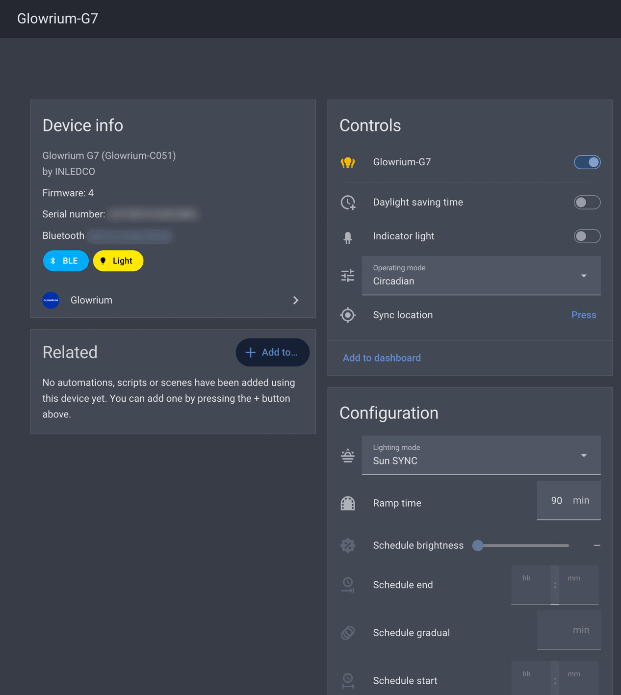

# Glowrium for Home Assistant

[](https://github.com/kugaevsky/glowrium-ha/actions/workflows/validate.yml)
[](https://github.com/kugaevsky/glowrium-ha/actions/workflows/test.yml)
[](https://github.com/hacs/integration)

Local **Bluetooth** control of the **INLEDCO Glowrium G7** BLE grow light from
Home Assistant — **no cloud, no vendor app**. The BLE protocol was
reverse-engineered from the official `com.inledco.glowrium` app and verified on
real hardware.

> Works fully offline over Bluetooth Low Energy. Once a device has been set up,
> Home Assistant owns it end to end — including provisioning a factory-reset
> lamp without ever touching the vendor app.



## Features

| Entity | Type | Notes |
| --- | --- | --- |
| Light | `light` | On/off + brightness (0–100 %) |
| Operating mode | `select` | **Manual** / **Circadian** / **Schedule** |
| Lighting mode | `select` | 8 circadian presets (Sun SYNC, Sunrise Sync, …) — *Circadian only* |
| Ramp time | `number` | Sunrise/sunset ramp, minutes — *Circadian only* |
| Schedule start / end | `time` | On/off times — *Schedule only* |
| Schedule gradual | `number` | Fade duration, minutes — *Schedule only* |
| Schedule brightness | `number` | Target brightness, % — *Schedule only* |
| Indicator light | `switch` | Front-panel status LED |
| Daylight saving time | `switch` | Device DST handling |
| Sync location | `button` | Pushes HA's home coordinates; the device recomputes its circadian curve itself |
| Latitude / Longitude | `sensor` | Diagnostic — the coordinates stored on the device |
| Activated | `binary_sensor` | Diagnostic — provisioning status (see [Provisioning](#provisioning)) |

**Mode-dependent availability:** *Lighting mode* and *Ramp time* are available
only in **Circadian**; the *Schedule* controls only in **Schedule**. The
integration drives the device's own native Circadian/Schedule engine rather than
reimplementing it in Home Assistant.

## Supported devices

The Glowrium grow-light family (INLEDCO's `com.inledco.glowrium` app) shares the
same BLE control protocol, so other models are likely compatible — but only the
**G7** has been verified on hardware. New models are added in
[`models.py`](custom_components/glowrium/models.py) once tested.

| Model | Form factor | Status |
| --- | --- | --- |
| **G7** | 48 W puck grow light | ✅ Integrated & tested |
| G2 / G2 Pro | Floor grow light (20–48 W) | ⬜ Not yet tested |
| G3 | Vertical grow light (10–36 W) | ⬜ Not yet tested |
| G4 | Desktop grow light (8–12 W) | ⬜ Not yet tested |
| G5 | Dual-head floor grow light (48 W) | ⬜ Not yet tested |
| G6 | Grow-light strip (48 W) | ⬜ Not yet tested |
| G8 | Desktop grow light (10 W) | ⬜ Not yet tested |
| G9 | Seed-starter kit (30 W) | ⬜ Not yet tested |
| G10 | Telescopic floor grow light | ⬜ Not yet tested |

> Glowrium also makes home/therapy lamps (H-series) and aquarium lights
> (A-series); those are out of scope for this integration.

### Tested an unverified model? Please report back 🙏

The whole Glowrium grow-light family shares the same BLE protocol, so a model
marked **⬜ Not yet tested** above will very likely work as-is — but I can only
mark it **verified** once someone has actually run it on real hardware.

**If you own one of these models and have used it with Home Assistant for a
while, please open a pull request with a short test report.** This is the single
most valuable contribution to the project: it's how a model moves from "likely
compatible" to "tested", and how its presets get confirmed in
[`models.py`](custom_components/glowrium/models.py). No need to be a developer —
a clear write-up is enough, and I'll help with the rest.

**What to include in your report**

1. **Model & firmware.** The model (e.g. *G3*) and the details from its device
   page in Home Assistant: manufacturer, model id (`pkey`, e.g. `Glowrium-C051`),
   firmware, and serial number.
2. **How you used it.** Roughly how long (a few days of normal use is great) and
   how — dashboard, automations, scenes, etc.
3. **What works.** Go entity by entity and say what behaves correctly:
   - Light — on/off and brightness;
   - Operating mode — Manual / Circadian / Schedule;
   - Lighting mode — the circadian presets (do the names/effects match?);
   - Ramp time; Schedule start/end, gradual, and brightness;
   - Indicator light; Daylight saving time; Sync location;
   - Diagnostic Latitude/Longitude sensors and the Activated sensor;
   - Bringing up a **factory-reset** unit (if you tried it).
4. **What's wrong or missing.** Anything that doesn't work, is stuck
   *unavailable*, behaves oddly, or that your device can do but the integration
   doesn't expose. For any errors, enable debug logging for
   `custom_components.glowrium` (Settings → Devices & services → ⋮ → Enable debug
   logging) and paste the relevant lines.
5. **Preset differences (optional).** If the lighting-mode names or order differ
   from the G7, note them. A btsnoop capture from the vendor app pins the exact
   indices — see [CONTRIBUTING.md](CONTRIBUTING.md).

**What the pull request should change**

- Flip your model's row in the **Supported devices** table above to
  **✅ Integrated & tested** (or *⚠️ Partial* with the caveats you found).
- If any presets/names differ from the G7, add or adjust the model's entry in
  [`models.py`](custom_components/glowrium/models.py) (one `GlowriumModel` record).
- Put the test summary itself in the pull-request description.

> Short on time or not comfortable with a PR? A GitHub **issue** with the same
> summary is very welcome too — I'll fold the results in and update the table.

## Requirements

- Home Assistant **2026.7** or newer.
- A **Bluetooth adapter on the Home Assistant host**, or an
  [ESPHome Bluetooth Proxy](https://esphome.io/components/bluetooth_proxy.html)
  within range of the lamp.
- The lamp allows a **single BLE connection** at a time — keep the vendor app
  disconnected while Home Assistant is in control.

## Installation

### HACS (recommended)

1. HACS → ⋮ → **Custom repositories**.
2. Add `https://github.com/kugaevsky/glowrium-ha` with category **Integration**.
3. Install **Glowrium**, then restart Home Assistant.

### Manual

Copy `custom_components/glowrium/` into your Home Assistant
`config/custom_components/` directory and restart Home Assistant.

## Configuration

The lamp advertises as `Glowrium-G7_XXXXXX` and is **discovered automatically** —
a notification appears under **Settings → Devices & services**. Otherwise add it
via **Add integration → Glowrium** and pick the device from the list. No
credentials are required.

## Provisioning

A factory-reset ("virgin") lamp advertises and accepts settings, but its light
output stays disabled (front-panel LEDs blink) until an activation handshake is
performed. This integration performs that handshake itself — **entirely locally,
with no cloud** — so a freshly reset device is brought up and controllable
without the vendor app. The **Activated** binary sensor reports this status; a
device already paired via the app stays activated across restarts.

## How it works

Control uses a custom GATT service (`facebd00-…`, "rabbit iot ble"): commands are
CBOR maps written to `facebd01`, state is read from CBOR notifications on
`facebd02`, and a readable `facebd80` string exposes model and firmware. The
device computes its own circadian sunrise/sunset curve from the coordinates it
stores, which is why **Sync location** simply writes your Home Assistant home
coordinates and lets the lamp do the astronomy.

For a deeper tour — the GATT/CBOR protocol, the activation handshake, the
availability model, and a step-by-step guide to adding another Glowrium model —
see **[ARCHITECTURE.md](ARCHITECTURE.md)**.

## Development

```bash
python3.14 -m venv .venv
.venv/bin/pip install -r requirements-test.txt
.venv/bin/ruff check . && .venv/bin/ruff format --check .
.venv/bin/pytest
```

## Disclaimer

This is an unofficial, community-built integration. It is **not affiliated with,
endorsed by, or supported by INLEDCO / Glowrium**. All product names and
trademarks belong to their respective owners. The protocol was reverse-engineered
for local interoperability; use at your own risk.

## License

[MIT](LICENSE) © Nick Kugaevsky
