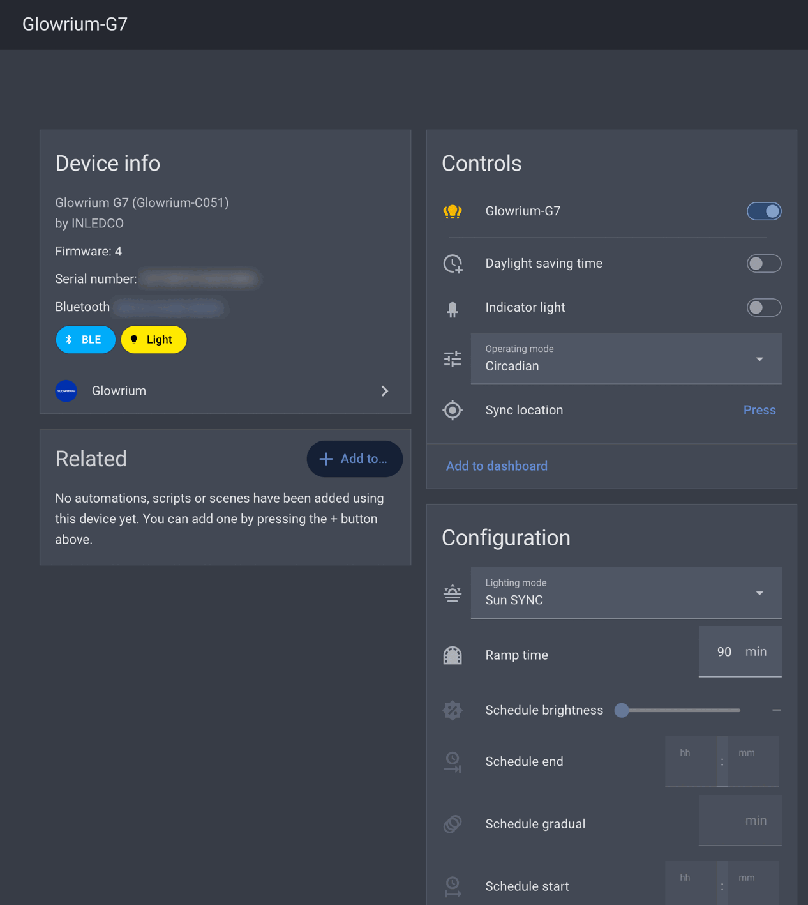

# Glowrium for Home Assistant

[](https://github.com/kugaevsky/glowrium-ha/actions/workflows/validate.yml)
[](https://github.com/kugaevsky/glowrium-ha/actions/workflows/test.yml)
[](https://github.com/hacs/integration)

Local **Bluetooth** control of the
**INLEDCO [Glowrium](https://www.glowrium.com/) G7** BLE grow light from
Home Assistant — **no cloud, no vendor app**. The BLE protocol was
reverse-engineered from the official `com.inledco.glowrium` app and verified on
real hardware.

> Works fully offline over Bluetooth Low Energy. Once a device has been set up,
> Home Assistant owns it end to end — including provisioning a factory-reset
> lamp without ever touching the vendor app.



## What it is for

With the lamp in Home Assistant it is one more device of the house, not an app
of its own:

- **Switch and dim it** from a dashboard, a scene or an automation — on a
  timetable of your own, or by something the lamp knows nothing of, such as
  whether anyone is home.
- **Hand it to its own program, and take it back.** The lamp can run itself by
  the sun (Circadian) or by an on and an off time (Schedule). Which of the
  two, and with which preset, ramp and times, is set from an automation like
  anything else.
- **Reach its settings without the app**: the indicator light, daylight saving
  time, the location it works sunrise and sunset out from.
- **See what it did.** The lamp reports what changes on it, the doing of its
  own program included, so its history is kept with the rest of the house's.
- **Bring up a factory-reset lamp** with no vendor app and no account (see
  [Provisioning](#provisioning)).

Three of these are written out under
[Automation examples](#automation-examples).

## Features

| Entity | Type | Notes |
| --- | --- | --- |
| Light | `light` | On/off + brightness (0–100 %) |
| Operating mode | `select` | **Manual** / **Circadian** / **Schedule** |
| Lighting mode | `select` | 8 circadian presets (Sun SYNC, Sunrise Sync, …) — *Circadian only* |
| Ramp time | `number` | Sunrise/sunset ramp, minutes — *Circadian only* |
| Schedule start / end | `time` | On/off times — *Schedule only* |
| Schedule gradual | `number` | Fade duration, minutes — *Schedule only* |
| Schedule brightness | `number` | Target brightness, % — *Schedule only* |
| Indicator light | `switch` | Front-panel status LED |
| Daylight saving time | `switch` | Device DST handling |
| Sync location | `button` | Pushes HA's home coordinates; the device recomputes its circadian curve itself |
| Latitude / Longitude | `sensor` | Diagnostic — the coordinates stored on the device; *disabled until you enable them* |
| Activated | `binary_sensor` | Diagnostic — provisioning status (see [Provisioning](#provisioning)) |

**Mode-dependent availability:** *Lighting mode* and *Ramp time* are available
only in **Circadian**; the *Schedule* controls only in **Schedule**. The
integration drives the device's own native Circadian/Schedule engine rather than
reimplementing it in Home Assistant.

**Controls and settings.** The light and the operating mode are the lamp's
controls. Everything else that can be set — lighting mode, ramp, the schedule,
the indicator, daylight saving time, *Sync location* — is a setting: it sits
under *Configuration* on the device page, and Home Assistant passes it over
when an action is aimed at a room or at the device as a whole. "Turn on every
switch in this room" does not set the daylight-saving flag; an action that
names the entity still does. *Latitude* and *Longitude* start disabled, so
that the position the lamp holds is not kept in states and history unasked:
enable them on the device page to see it.

**Lighting modes in automations.** The select shows the vendor's names; what
it stores, and what `select.select_option` takes, is a key: `sun_sync`,
`before_sunrise`, `sunrise_sync`, `sunset_sync`, `after_sunset`, `two_phase`,
`balance`, `enhanced_two_phase`. Before 0.3.0 the names themselves were the
options — the [changelog](CHANGELOG.md) has the table if you are upgrading.
A call is shown under [Automation examples](#automation-examples).

## Supported devices

The Glowrium grow-light family (INLEDCO's `com.inledco.glowrium` app) shares the
same BLE control protocol, so other models are likely compatible. The **G7** is
verified end to end; the **G8** runs on real hardware with its presets still
unconfirmed (see below). New models are added in
[`models.py`](custom_components/glowrium/models.py) once tested.

| Model | Form factor | Status |
| --- | --- | --- |
| **G7** | 48 W puck grow light | ✅ Integrated & tested |
| G2 / G2 Pro | Floor grow light (20–48 W) | ⬜ Not yet tested |
| G3 | Vertical grow light (10–36 W) | ⬜ Not yet tested |
| G4 | Desktop grow light (8–12 W) | ⬜ Not yet tested |
| G5 | Dual-head floor grow light (48 W) | ⬜ Not yet tested |
| G6 | Grow-light strip (48 W) | ⬜ Not yet tested |
| G8 | Desktop grow light (10 W) | 🟡 Runs on hardware; presets unconfirmed |
| G9 | Seed-starter kit (30 W) | ⬜ Not yet tested |
| G10 | Telescopic floor grow light | ⬜ Not yet tested |

> Glowrium also makes home/therapy lamps (H-series) and aquarium lights
> (A-series); those are out of scope for this integration.

**About the G8.** Two of them have been run on real hardware by
[@pentafive](https://github.com/pentafive), who also found and fixed the reason
every state entity read `unknown` on them ([#5](https://github.com/kugaevsky/glowrium-ha/pull/5)).
On/off, brightness and state reporting work. What is **not** confirmed is the
circadian **presets**: `models.py` has no G8 entry, so the lighting-mode select
offers the G7's presets and sends the G7's indices, which may not be what the
same names mean on a G8. Choosing one writes that index; the integration has
nothing better to go on. What it will not do is change a setting it would
have to guess at. Setting the **ramp** rewrites the lighting mode along with
it, so on a lamp that has not reported its mode — and a G8, which refuses to
be asked for its state, may never report it — the ramp control reports an
error instead of quietly resetting the mode, and so does a switch to
Circadian that would have to re-apply a ramp. Confirming the preset indices
needs one btsnoop capture from the vendor app; see
[CONTRIBUTING](CONTRIBUTING.md).

One thing changed underneath the G8 in 0.3.0. A lamp is now asked for its
state instead of being read, because on a Linux host a read turned out to end
the link (see the [changelog](CHANGELOG.md)). A G8 refuses to be asked, so it
is still read, as before — which should leave a G8 working as it did, and on
such a host still reconnecting after every read. Neither half of that has been
run on a G8 since the change; a report from one, good or bad, is very welcome.

### Tested an unverified model? Please report back 🙏

The whole Glowrium grow-light family shares the same BLE protocol, so a model
marked **⬜ Not yet tested** above will probably work as-is — but "probably" has
already been wrong once: the G8 splits its state across notifications in a way
the G7 never does, and every state entity read `unknown` until a G8 owner
diagnosed it. So a model is only marked **verified** once someone has actually
run it on real hardware.

**If you own one of these models and have used it with Home Assistant for a
while, please open a pull request with a short test report.** This is the single
most valuable contribution to the project: it's how a model moves from "likely
compatible" to "tested", and how its presets get confirmed in
[`models.py`](custom_components/glowrium/models.py). No need to be a developer —
a clear write-up is enough, and I'll help with the rest.

**What to include in your report**

1. **Model & firmware.** The model (e.g. *G3*) and, from its device page in
   Home Assistant, the model id (`pkey`, e.g. `Glowrium-C051`) and the
   firmware. Easier still: attach the diagnostics download from that page
   (⋮ → *Download diagnostics*), which carries both along with what the lamp
   reported. See [Troubleshooting](#troubleshooting) for what is and is not
   in that file.
2. **How you used it.** Roughly how long (a few days of normal use is great) and
   how — dashboard, automations, scenes, etc.
3. **What works.** Go entity by entity and say what behaves correctly:
   - Light — on/off and brightness;
   - Operating mode — Manual / Circadian / Schedule;
   - Lighting mode — the circadian presets (do the names/effects match?);
   - Ramp time; Schedule start/end, gradual, and brightness;
   - Indicator light; Daylight saving time; Sync location;
   - Diagnostic Latitude/Longitude sensors (enable them first) and the Activated sensor;
   - Bringing up a **factory-reset** unit (if you tried it).
4. **What's wrong or missing.** Anything that doesn't work, is stuck
   *unavailable*, behaves oddly, or that your device can do but the integration
   doesn't expose. For any errors, enable debug logging for
   `custom_components.glowrium` (Settings → Devices & services → ⋮ → Enable debug
   logging) and paste the relevant lines.
5. **Preset differences (optional).** If the lighting-mode names or order differ
   from the G7, note them. A btsnoop capture from the vendor app pins the exact
   indices — see [CONTRIBUTING.md](CONTRIBUTING.md).

**What the pull request should change**

- Flip your model's row in the **Supported devices** table above to
  **✅ Integrated & tested** (or *⚠️ Partial* with the caveats you found).
- If any presets/names differ from the G7, add or adjust the model's entry in
  [`models.py`](custom_components/glowrium/models.py) (one `GlowriumModel` record).
- Put the test summary itself in the pull-request description.

> Short on time or not comfortable with a PR? A GitHub **issue** with the same
> summary is very welcome too — I'll fold the results in and update the table.

## Requirements

- Home Assistant **2026.7** or newer.
- A **Bluetooth adapter on the Home Assistant host**, or an
  [ESPHome Bluetooth Proxy](https://esphome.io/components/bluetooth_proxy.html)
  within range of the lamp.
- The lamp allows a **single BLE connection** at a time — keep the vendor app
  disconnected while Home Assistant is in control.

## Installation

### HACS (recommended)

1. HACS → ⋮ → **Custom repositories**.
2. Add `https://github.com/kugaevsky/glowrium-ha` with category **Integration**.
3. Install **Glowrium**, then restart Home Assistant.

### Manual

Copy `custom_components/glowrium/` into your Home Assistant
`config/custom_components/` directory and restart Home Assistant.

## Configuration

The lamp advertises as `Glowrium-G7_XXXXXX` and is **discovered automatically** —
a notification appears under **Settings → Devices & services**. Otherwise add it
via **Add integration → Glowrium** and pick the device from the list. No
credentials are required.

## Provisioning

A factory-reset ("virgin") lamp advertises and accepts settings, but its light
output stays disabled (front-panel LEDs blink) until an activation handshake is
performed. This integration performs that handshake itself — **entirely locally,
with no cloud** — so a freshly reset device is brought up and controllable
without the vendor app. The **Activated** binary sensor reports this status; a
device already paired via the app stays activated across restarts.

## Automation examples

Each block is one automation, as the automation editor shows it in YAML mode.
The entity ids are placeholders: the device page lists the real ones, which
carry your lamp's name where these have `xxxxxx`. Nothing else needs
changing. The integration adds no actions of its own; these are Home
Assistant's, for the kind of entity each one is.

**Switch the light on a timetable of your own** — on at seven, at 80 %; a
second automation with `light.turn_off` ends the day. It is written for a
lamp in **Manual**. In Circadian and Schedule the lamp's own program
switches it as well, and how the two get on has not been tried.

```yaml
alias: Grow lamp on in the morning
triggers:
  - trigger: time
    at: "07:00:00"
actions:
  - action: light.turn_on
    target:
      entity_id: light.glowrium_g7_xxxxxx
    data:
      brightness_pct: 80
```

**Hand the lamp to its circadian program when the last person leaves.** The
operating mode goes first: a lighting mode can only be chosen in Circadian.
In another mode the select is unavailable, and Home Assistant passes a call
to it over with a warning in the log. The lighting mode is named by its key,
`sunrise_sync`, not by the name the select shows (see
[Features](#features)). The trigger counts the people Home Assistant tracks
at home, so it needs some tracked; and nothing here takes the lamp back - an
automation of its own does that when somebody returns.

```yaml
alias: Grow lamp runs itself once nobody is home
triggers:
  - trigger: numeric_state
    entity_id: zone.home
    below: 1
actions:
  - action: select.select_option
    target:
      entity_id: select.glowrium_g7_xxxxxx_operating_mode
    data:
      option: circadian
  - action: select.select_option
    target:
      entity_id: select.glowrium_g7_xxxxxx_lighting_mode
    data:
      option: sunrise_sync
```

**Put the indicator light out for the night.** `switch.turn_on` brings it back
in the morning.

```yaml
alias: Grow lamp indicator off at night
triggers:
  - trigger: time
    at: "22:00:00"
actions:
  - action: switch.turn_off
    target:
      entity_id: switch.glowrium_g7_xxxxxx_indicator_light
```

The other entities go the same way: `number.set_value` for *Ramp time* and the
two schedule numbers, `time.set_value` for *Schedule start* and *end*,
`button.press` for *Sync location*.

## How state is updated

The lamp pushes its state. Over the Bluetooth link the integration holds, the
lamp reports each change as it happens — one its own program made as much as
one made from Home Assistant — and the entities follow. State is not polled.
The lamp is asked for it when a link is made, which is also how a
setting changed from the vendor app while Home Assistant was not connected is
picked up. (A lamp that refuses to be asked is read instead: see
`refused the batched state request` under [Troubleshooting](#troubleshooting).)

The link does not last, and is rebuilt in the background: when the lamp is
next heard advertising, and on a 30-second tick besides. The same tick asks a
link that has said nothing for five minutes whether it is still there. None of
this shows on the entities. Availability follows the lamp's advertisements,
not the link, so they stay available for as long as the lamp is heard; between
links each shows the last value it had, and a command sent then makes its own
connection first.

After a restart of Home Assistant everything that can be set, the light apart
— operating mode, lighting mode, ramp, schedule, indicator, daylight saving
time — shows the value it showed before it, until the lamp reports. One that
showed none has none to show: what belongs to a mode the lamp was not in is
unavailable, and comes back `unknown`. The light is not remembered at all: a lamp said to be on
while it is off is worse than `unknown`, so the light, like the diagnostic
entities, reads `unknown` until the lamp has spoken. On a first start nothing
is remembered yet, and the settings read `unknown` as well. A remembered value
is only shown, never written from. Changing the ramp or a part of the schedule
before the lamp has reported what the change builds on — its lighting mode,
its schedule — is therefore refused, with a message that says so.

## Known limitations

What the integration cannot do, as distinct from what it gets wrong.

- **One Bluetooth connection at a time.** The lamp takes a single connection,
  so the vendor app has to stay disconnected while Home Assistant is in
  control (see [Requirements](#requirements)).
- **No firmware update.** The firmware version on the device page is read from
  the lamp; nothing here can change it.
- **Only the lamp, not the rest of the vendor app.** The integration talks to
  the lamp over Bluetooth and to nothing else: there is no vendor account in
  it, and none of what the app offers beyond the lamp's own controls.
- **The lamp's location can only be set to Home Assistant's own.** *Sync
  location* writes the home coordinates Home Assistant is set to, and there is
  no giving it others. *Latitude* and *Longitude* show what the lamp holds and
  cannot be set.
- **The circadian presets are confirmed for one model, the G7.** A model
  without a profile of its own is offered the G7's presets and sends the G7's
  indices until its own are known (see
  [Supported devices](#supported-devices)).
- **A Linux host, and the G8.** Both are described where they show, and not
  again here: what a read of the lamp costs on a Linux host is under
  [Troubleshooting](#troubleshooting), and what is and is not confirmed on a
  G8 is under [Supported devices](#supported-devices).

## Troubleshooting

The integration says what it finds in the Home Assistant log. These are the
messages worth acting on, and two symptoms that come without one.

- **`BlueZ has left 3 requests in a row to disconnect the lamp unanswered`** —
  the host's Bluetooth stack is holding on to a link that no longer exists,
  and the lamp cannot be reached until it lets go. That is the host, not the
  lamp. Power-cycle the adapter (`bluetoothctl power off`, then
  `bluetoothctl power on`) or restart the bluetooth service; Home Assistant
  takes the adapter back by itself and the lamp follows within about five
  minutes, with `the lamp answers again` in the log. Restarting Home
  Assistant alone does not clear it. BlueZ before 5.84 can get into this
  state — `Failed to disconnect device: Disconnected (0x0e)` in the journal
  of the bluetooth service is how it shows there. The same thing is raised
  under **Settings → System → Repairs**, and goes from there by itself when
  the lamp answers again.
- **`refused the batched state request`** — the lamp will not report its state
  when asked. That is a property of the model (a G8 does it), not a fault:
  commands still work and the state is read instead, but the indicator,
  lighting mode, ramp and DST stay `unknown`. Please
  [report the model](CONTRIBUTING.md#sending-protocol-data-for-a-device).
- **`sent a frame with … trailing bytes and it was dropped`** — a frame the
  decoder would not trust. The message carries it as hex, which is exactly
  what an issue needs. A frame can hold the coordinates the lamp stores and
  the sunrise and sunset times it works out from them; in the log both are
  already replaced by `xx`. Give the line one look all the same before
  posting it.
- **`sent a frame with an item this integration cannot read`** — the lamp
  reports something no reading has been written for. What came before it in
  the frame is kept, so the lamp goes on working; what follows it is lost.
  The message carries the frame, blanked the same way, and an issue with it
  is how the reading gets written.
- **A command fails with "out of range or the Bluetooth adapter busy"** — the
  write did not get through. Check that the vendor app is not connected (the
  lamp takes one connection at a time) and that an adapter or a proxy is
  within range of the lamp.
- **Sync location fails with "Home Assistant has no home location set"** —
  the latitude and the longitude Home Assistant holds are both zero, which
  is what it has when it was never given a position. Written to the lamp,
  that would put it where the equator meets the prime meridian. Set the home
  location in Home Assistant and press again. A home with one of the two at
  zero is a real place and is sent as it is.
- **A command fails with "the integration is being reloaded or Home Assistant
  is stopping"** — it arrived while the integration was on its way out.
  Nothing is wrong with the lamp or with the radio; send it again once the
  integration is running again.
- **A command fails with "the previous Bluetooth connection to it could not be
  closed"** — the integration is left holding a connection it can neither hang
  up nor close, and does not open another on top of it: each one would cost
  the host a connection to its system bus. It keeps trying to close it, and a
  restart of Home Assistant lets go of it. If it comes back after the restart,
  the host's Bluetooth stack is holding on to the link: clear it as for the
  unanswered disconnects above, which is what the log and the repair say
  too once three of them have gone unanswered.
  Either way, please open an issue: it means the Bluetooth library has changed
  underneath the integration.
- **Every entity is `unavailable`** — the lamp is not being heard at all: no
  power, out of range, or the adapter is down. Availability follows the
  lamp's advertisements, not the connection, so a lamp that is merely
  reconnecting does not show this. The log says since when: `is out of
  reach`, and `is back in reach` when it returns.

With debug logging on, a Linux host shows one link after every start or
reload that lasts two seconds — `device info read`, then `disconnected` — and
is rebuilt on the next 30-second tick. That one is expected: the model and
firmware can only be had by a read, and through BlueZ a read costs the link —
the lamp answers a read twice, and BlueZ hangs up on the extra answer.

For anything else, open an issue with two things from the integration's page
(Settings → Devices & services → Glowrium → ⋮).

**Download diagnostics** gives one file with the model, the firmware, what the
lamp reported and where the link stands. What this integration writes into it
has nothing that says where the lamp is or which one it is: not the
coordinates the lamp stores, not its serial number, not its address. Home
Assistant puts a header of its own on every diagnostics file — its version and
how it is installed, the host's time zone, the names of your custom
integrations — so look the file over before you attach it.

**Enable debug logging** raises the level for the integration and for the
Bluetooth libraries under it. Reproduce the problem, switch it off again, and
take the lines around the problem from the log it offers. A log is not made
for posting the way the diagnostics are: it names the lamp by its Bluetooth
address, and at debug level the libraries name the other devices they hear
too. Blank what you would rather not publish.

## Removing the integration

Delete it like any other: **Settings → Devices & services → Glowrium → ⋮ →
Delete**. If it was installed through HACS, remove it there as well and
restart Home Assistant.

Nothing is left behind on the lamp. It keeps its settings, its schedule, its
clock and its activation, and goes on running its own program; the vendor app
can connect to it again as soon as Home Assistant has let go of the link.

## How it works

Control uses a custom GATT service (`facebd00-…`, "rabbit iot ble"): commands are
CBOR maps written to `facebd01`, state arrives as CBOR notifications on
`facebd02` — asked for once on connect, then pushed by the lamp as it changes —
and a readable `facebd80` string exposes model and firmware. The
device computes its own circadian sunrise/sunset curve from the coordinates it
stores, which is why **Sync location** simply writes your Home Assistant home
coordinates and lets the lamp do the astronomy.

For a deeper tour — the GATT/CBOR protocol, the activation handshake, the
availability model, and a step-by-step guide to adding another Glowrium model —
see **[ARCHITECTURE.md](ARCHITECTURE.md)**.

## Development

```bash
python3.14 -m venv .venv
.venv/bin/python tools/stack.py oldest   # or: newest
.venv/bin/ruff check . && .venv/bin/ruff format --check .
.venv/bin/mypy
.venv/bin/pytest
```

`oldest` is the oldest Home Assistant supported, `newest` is the newest there is; CI runs
the checks on both. [CONTRIBUTING.md](CONTRIBUTING.md#development-setup) has what the
script installs and why.

## Disclaimer

This is an unofficial, community-built integration. It is **not affiliated with,
endorsed by, or supported by INLEDCO / Glowrium**. All product names and
trademarks belong to their respective owners. The protocol was reverse-engineered
for local interoperability; use at your own risk.

## License

[MIT](LICENSE) © Nick Kugaevsky
